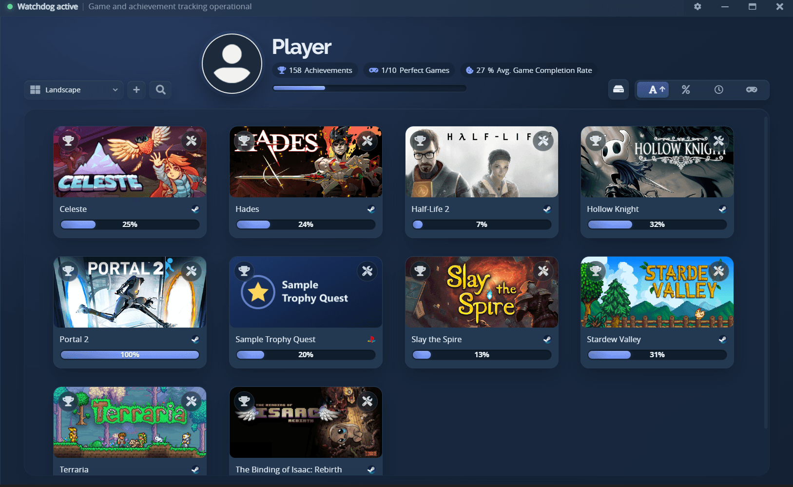
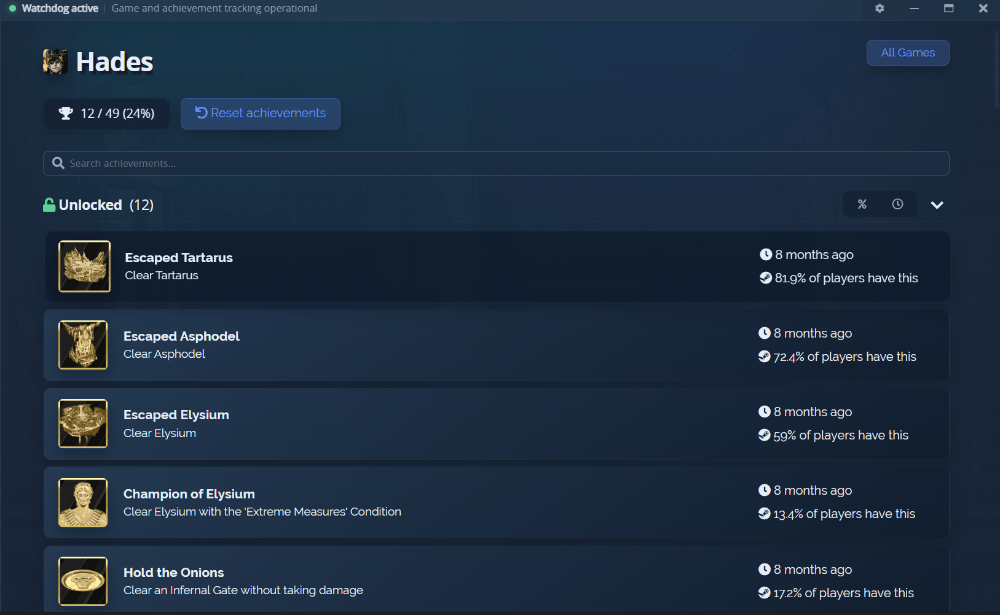
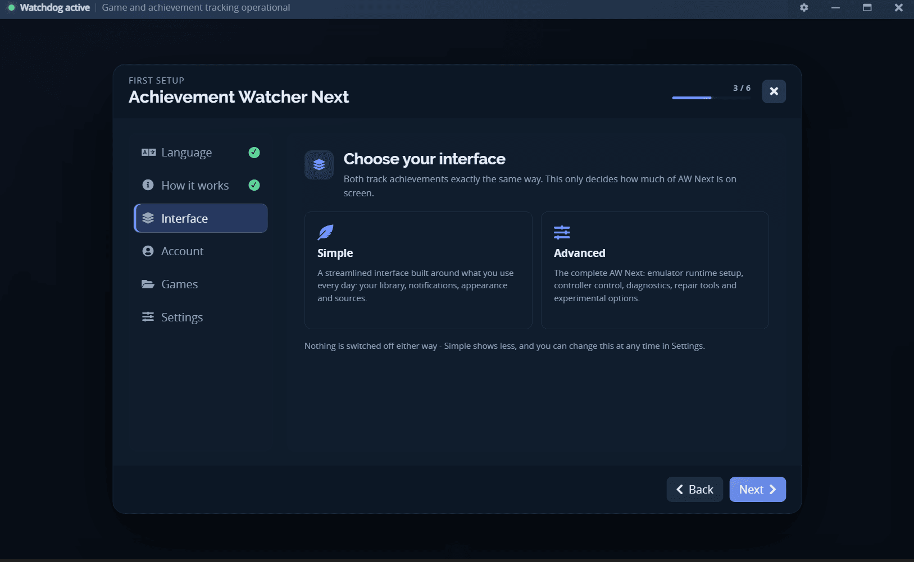
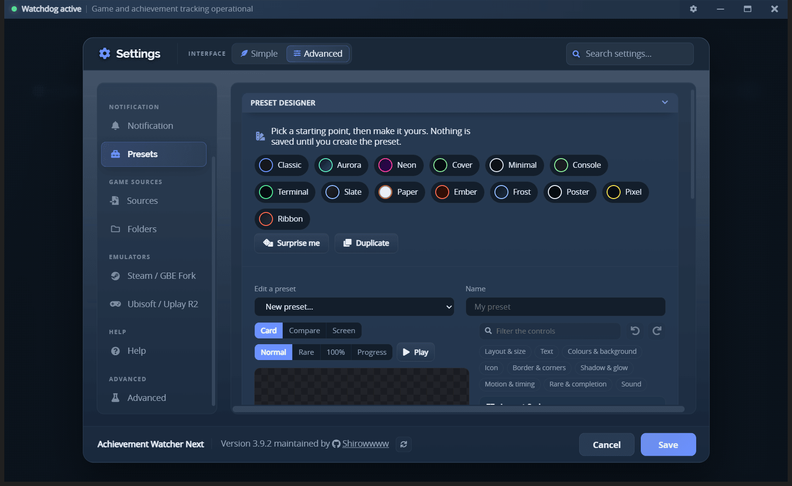
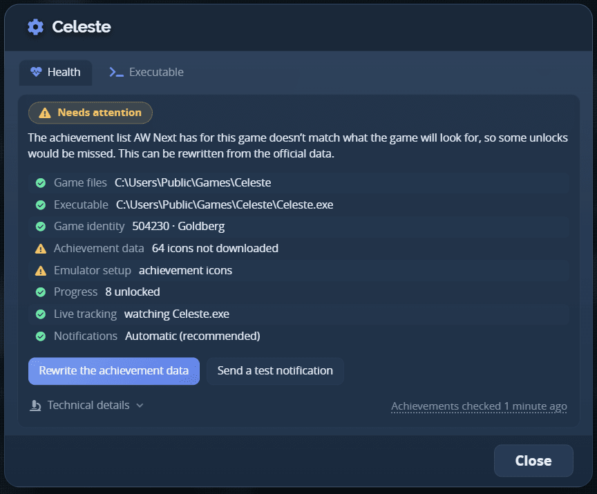

# 🏆 Achievement Watcher Next

<strong>A unified achievement tracker for Windows.</strong>

AW Next brings achievements, rarity and playtime from launchers, local saves and supported emulators
into one library, with live Windows notifications and an in-game overlay.

**[Visit the website](https://shirowwww.github.io/Achievement-Watcher-Next/)** ·
**[Download](https://github.com/Shirowwww/Achievement-Watcher-Next/releases/latest)** ·
[Docs](https://shirowwww.github.io/Achievement-Watcher-Next/README.html) ·
[Sources](https://shirowwww.github.io/Achievement-Watcher-Next/sources.html) ·
[Presets](https://shirowwww.github.io/Achievement-Watcher-Next/gallery/) ·
[Themes](https://shirowwww.github.io/Achievement-Watcher-Next/gallery/themes/) ·
[GitHub](https://github.com/Shirowwww/Achievement-Watcher-Next)

<table>
<tr>
<td align="center"> One library for every supported source</td>
<td align="center"> Progress, rarity and unlock history</td>
</tr>
</table>

---

## Highlights

- **Unified library.** Launcher data, Steam-compatible saves and console emulators in a single list,
  with search, filters, rarity tiers, progress achievements and covers.
- **Automatic notification delivery.** With **Automatic** selected, each unlock arrives through the
  in-game popup when it can be seen, and as a Windows notification when it cannot - never both.
- **Preset Designer and sharing.** Nine bundled presets, a no-code designer that previews the real
  popup, one-file `.awpreset` sharing, a converter for your own Steam Achievement Notifier `.san`
  themes and a [community gallery](https://shirowwww.github.io/Achievement-Watcher-Next/gallery/).
- **In-game overlay.** The running game's full achievement list on `Ctrl+Shift+K`, with search,
  filters and rarity badges - drivable entirely from a gamepad.
- **Game Health.** Each game has a health panel that says whether it is tracked, why not, and offers
  only the repairs that genuinely apply.
- **Guided repairs.** Read-only diagnosis, `steam_settings` repair, matched GBE Fork runtime install,
  architecture-safe automatic Uplay R1 and R2 repair, transactional backups and restore.
- **Flexible interface.** Simple and Advanced modes, full controller navigation, 28 bundled
  interface languages, and thirteen built-in palettes - every one of them editable per layer, savable
  as your own and shareable as a portable `.awtheme` with its own
  [gallery](https://shirowwww.github.io/Achievement-Watcher-Next/gallery/themes/).
- **Local-first.** No Steam Web API key, no required account, its own data directory, and caches that
  keep the library working offline. The few secrets it does keep - an emulator Steam password, the
  Epic and Xbox sign-in tokens - are encrypted with a key generated for your install and held by
  Windows, readable by your Windows account alone.

<table>
<tr>
<td align="center"> Guided first-run setup</td>
<td align="center"> Design the popup, previewed live</td>
<td align="center"> Per-game health and guided repairs</td>
</tr>
</table>

→ [How AW Next compares to Achievement Watcher 2.x and Achievements](https://shirowwww.github.io/Achievement-Watcher-Next/comparison.html)

---

## Quick start

1. Download `Achievement.Watcher.Setup.<version>.exe` from the
   [latest release](https://github.com/Shirowwww/Achievement-Watcher-Next/releases/latest).
2. Install and open AW Next, then follow the first-run guide.
3. Run **Settings → Folders → Smart Find**, and add any custom game or save location.
4. Leave the app in the system tray for live notifications and playtime tracking.

Settings, watched folders, caches, playtime, logs and user presets live in
`%APPDATA%\Achievement Watcher Next`. Upgrading preserves them, and the first launch after an
upgrade imports an older Achievement Watcher folder without modifying it.

→ [Getting started](https://shirowwww.github.io/Achievement-Watcher-Next/getting-started.html) for the full first-run, discovery and update guide.

---

## Supported sources

| Source | Support |
|---|---|
| **Steam** | Local appcache state, public-profile data, achievement lists (including DLC/update tags) and cached product metadata; an optional account connection covers a private profile and Steam Family |
| **Steam-compatible saves** | Goldberg, GBE Fork, GreenLuma, LumaPlay, SmartSteamEmu, CreamAPI, Nemirtingas and compatible layouts |
| **GOG Galaxy** | Native local Galaxy databases and compatible legacy saves |
| **Epic Games** | Local installations, and after an optional account connection, the games the account owns with their official achievement state |
| **Ubisoft Connect** | Native local data, legacy Uplay formats and compatible Uplay R1 and R2 setups |
| **EA Desktop** | Achievement events from the local EA Desktop log, for games outside EA's managed folders |
| **Console emulators** | RPCS3, ShadPS4 and Xenia, each watched live |
| **Xbox PC** | Local Game Pass / Microsoft Store installs, plus the games the account owns and their Xbox Network state |
| **Games for Windows LIVE** | XLiveLessNess profiles, with the achievement list, its texts and its icons read from the game's own executable |

Sources are controlled individually, and no Steam Web API key is used: achievement lists come from
public endpoints and are cached locally.

→ [Compatible sources](https://shirowwww.github.io/Achievement-Watcher-Next/sources.html) · [Goldberg / GBE setup](https://shirowwww.github.io/Achievement-Watcher-Next/emulator-setup.html) ·
[Uplay R2 setup](https://shirowwww.github.io/Achievement-Watcher-Next/uplay-r2.html)

> [!WARNING]
> Reading achievements is read-only. The emulator repair tools do modify game files - always after a
> confirmation and always with a backup. Use them only with games you own.

---

## Documentation

Start at the **[documentation site](https://shirowwww.github.io/Achievement-Watcher-Next/README.html)**, which explains what each guide covers.

- **Start:** [Getting started](https://shirowwww.github.io/Achievement-Watcher-Next/getting-started.html) ·
  [Sources](https://shirowwww.github.io/Achievement-Watcher-Next/sources.html) ·
  [Notifications](https://shirowwww.github.io/Achievement-Watcher-Next/notifications.html) ·
  [Presets](https://shirowwww.github.io/Achievement-Watcher-Next/presets.html)
- **Use:** [Overlay](https://shirowwww.github.io/Achievement-Watcher-Next/overlay.html) ·
  [Controller](https://shirowwww.github.io/Achievement-Watcher-Next/controller.html) ·
  [Game Health](https://shirowwww.github.io/Achievement-Watcher-Next/game-health.html) ·
  [Community galleries](https://shirowwww.github.io/Achievement-Watcher-Next/community-galleries.html) ·
  [Advanced tools](https://shirowwww.github.io/Achievement-Watcher-Next/advanced.html)
- **Fix a problem:**
  [Troubleshooting](https://shirowwww.github.io/Achievement-Watcher-Next/troubleshooting.html) ·
  [FAQ](https://shirowwww.github.io/Achievement-Watcher-Next/faq.html) ·
  [Issue tracker](https://github.com/Shirowwww/Achievement-Watcher-Next/issues)
- **Contribute:** [Contributing](CONTRIBUTING.md) · [Build guide](BUILD.md) ·
  [Architecture](https://shirowwww.github.io/Achievement-Watcher-Next/architecture.html) ·
  [Release workflow](https://shirowwww.github.io/Achievement-Watcher-Next/RELEASE_WORKFLOW.html)

## Build from source

Requires Windows and Node.js `22.22.2+` or `24.15+`. The app and the background Watchdog are separate
npm projects; `npm run build` writes the installer and updater files to `app\dist`. See
[BUILD.md](BUILD.md) for setup, packaging details and known constraints.

## Security and support

Found a problem or have an idea? [Open an issue](https://github.com/Shirowwww/Achievement-Watcher-Next/issues).
For a vulnerability, use the private process in the [security policy](SECURITY.md) rather than a
public issue.

Download builds only from the
[official releases page](https://github.com/Shirowwww/Achievement-Watcher-Next/releases); `latest.yml`
carries the installer's SHA-512 digest. Installers use the project's self-signed `CN=Shirow`
certificate, which you do not need to install or trust - SmartScreen or antivirus warnings remain
possible because it is not issued by a publicly trusted authority. Sensitive settings and
connected-account tokens are encrypted before local storage, and the project contains no game files
and does not bypass online ownership checks.

### Your antivirus may flag the emulator files

It is a false positive. The Steam emulator (GBE Fork) and the Ubisoft loaders stand in for a game's
Steam or Ubisoft library, which is exactly the behaviour detection engines look for: they are judged
on what they do, not on anything they contain. Both are third-party and open source, and the bundled
ones are checked against known SHA-256 digests before any repair may use them.

None is written unless you ask - a repair you run, the Emulators tab, or automatic repair, which is
off by default and warns you first. Allow the file your antivirus named, or exclude
`%APPDATA%\Achievement Watcher Next\cache`; never switch protection off.

→ [Troubleshooting → Antivirus](https://shirowwww.github.io/Achievement-Watcher-Next/troubleshooting.html#the-emulator-files-are-flagged)

For a bug report, include the app version, Windows version, affected source and the relevant files
from `%APPDATA%\Achievement Watcher Next\logs`. The issue tracker cannot provide games, credentials
or piracy support.

## Credits and license

Created by [Xan105](https://github.com/xan105/Achievement-Watcher), continued by
[darktakayanagi](https://github.com/darktakayanagi/Achievement-Watcher), and maintained here by
Shirowwww and project contributors. Redistributions of this fork must retain the project attribution
in [NOTICE](NOTICE).

Licensed under [LGPL-3.0](LICENSE). This project is not affiliated with Valve, Sony, Microsoft, GOG,
Epic Games, Electronic Arts or Ubisoft.
