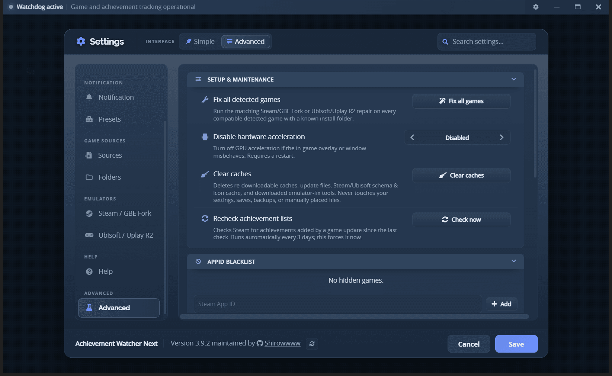

# Advanced tools

The tools on this page live under **Settings → Advanced**, or in a game's right-click menu. The
Advanced tab only exists while the interface is in **Advanced** mode - switch the **Interface**
control at the top of Settings if you do not see it. Nothing is lost by switching back afterwards.

 
Setup &amp; maintenance, and the AppID blacklist

## Setup and maintenance

| Tool | What it does |
|---|---|
| **Fix all detected games** | Runs the appropriate repair (Steam/GBE Fork or Ubisoft/Uplay R2) over every compatible detected game with a known install folder. This is what rebuilds games that already have a setup. |
| **Disable hardware acceleration** | Turns off GPU acceleration when the window or overlay misbehaves. Requires a restart. |
| **Clear caches** | Deletes only re-downloadable caches: update files, the Steam/Ubisoft schema and icon cache, and downloaded emulator-fix tools. Settings, saves, backups and manually placed files are never touched. |
| **Recheck achievement lists** | Checks Steam for achievements added by a game update since the last check. This runs automatically every 3 days; the button forces it now. |

Source-specific repair settings are split under **Settings → Emulators**. **Ubisoft / Uplay R2**
contains its package health, DLL import/restore controls, and targeted batch repair. Loader and INI
details stay automatic.

**Clear caches** is the first thing to try when an update keeps failing on the same downloaded file.

## Diagnostics

 
Versions, and one click to the logs and data folders

The Diagnostics card prints the app, Electron, Node and Chrome versions, and opens the logs folder,
the data folder or an update check. **Export logs (.zip)** bundles every log file into one archive
without closing the app first - the processes writing those files never stop, so copying them by
hand is unreliable in exactly the situation the logs are wanted for. Those versions and the log
files are what a bug report needs - see
[Troubleshooting](troubleshooting.md#open-logs-and-local-data) for what to collect and how to strip
private data from it first.

## AppID blacklist

A game you removed from the library with **Blacklist** is listed here with the ID it was blacklisted
under, and can be restored individually. Blacklisting is how you get rid of a stray folder that the
scan keeps finding but that is not really a game.

## Reset a game's achievements

To play a game through again from zero, use **Reset achievements** - on the game's page beside the
playtime, or from its right-click menu. Every achievement goes back to locked, so the game can unlock
them again and AW Next announces them as new when it does.

 
Reset sits beside the completion count on the game's own page

Nothing is deleted without a copy. Every file involved is backed up first to
`%APPDATA%\Achievement Watcher Next\backups\achievements\<appid>\<date>\`, and the confirmation lists
the exact files before anything is touched. A file whose backup fails is skipped rather than cleared.

| Source | What a reset does |
|---|---|
| Steam emulators (Goldberg / GBE and compatible layouts, including Goldberg SocialClub and Uplay R2) | Removes the achievement save. The emulator writes a fresh one at the next unlock. |
| RPCS3 | Removes `TROPUSR.DAT`. The trophy list (`TROPCONF.SFM`) is left alone. |
| ShadPS4 | Relocks the trophies inside `TROP*.XML`, which also holds the trophy list - so the file is edited, never removed. |
| Xenia | Clears the earned flag inside the `.gpd`, which also holds the achievement list - same reason. |
| Steam, GOG Galaxy, Ubisoft Connect, EA, Epic, Xbox | **Not possible.** These keep unlocks on your account and re-synchronise them; only the account itself can clear them. AW Next says so instead of appearing to work. |

Progress counters stored beside the achievements (`stats.ini`, `stats.bin`, …) are reset too: for a
"travel 1000 km" style achievement the counter *is* the progress, and leaving it full would make the
achievement either fire instantly or never again. They are in the backup like everything else.

**Restore an achievement backup**, in the same right-click menu, puts a whole reset back where it
came from. Refresh the library afterwards to read the restored unlocks back in.

> [!NOTE]
> AW Next's own record of what was already unlocked is cleared at the same time, including in the
> running background tracker. Without that, a re-earned achievement would be compared against a
> record that still had it and would never be announced again.

## Add a game manually

The `+` beside the library search adds a game from a title and an executable, with an optional
platform and Steam AppID. Use it for a game no source detects - a standalone build, a portable
install, or an emulator you launch yourself.

A manually added game:

- is launchable and tracks playtime like any other entry;
- shows **No achievements** if it has none, and is left out of completion statistics rather than
  counted as 0%;
- can adopt a Steam achievement schema later, by adding the AppID, without being recreated;
- keeps guarded per-game diagnostics, while destructive actions stay hidden.

Manually added folders are marked with a compact icon in the Folders list, so you can tell them from
the locations Smart Find discovered.

## Mark an achievement as unlocked

An achievement that a source cannot see - one earned before you set tracking up, or one an emulator
never recorded - can be marked by hand from its right-click menu: **Mark as manually unlocked**, and
**Clear manual unlock** to undo it. Manual unlocks persist across scans, and are cleared along with
everything else by a reset.

## Emulator and repair tools

Diagnosis and repair for Goldberg / GBE Fork setups, the GBE runtime installer, Steamless and the
opt-in API-check bypass live in **Settings → Emulators** and in each game's **Emulator & tools**
submenu. They have their own guides:

- [Goldberg / GBE setup](emulator-setup.md) - diagnose and repair an emulated Steam game
- [Uplay R2 setup](uplay-r2.md) - the Ubisoft equivalent
- [Goldberg / GBE reference](goldberg-gbe.md) - file formats and detection rules

> [!WARNING]
> Repairs create backups, but they still modify game files. Use them only with games you own.

---

**Next:** [FAQ](faq.md) - short answers to the questions that come up most.

[← Documentation](README.md) · [Troubleshooting](troubleshooting.md) · [Project home](https://github.com/Shirowwww/Achievement-Watcher-Next)

