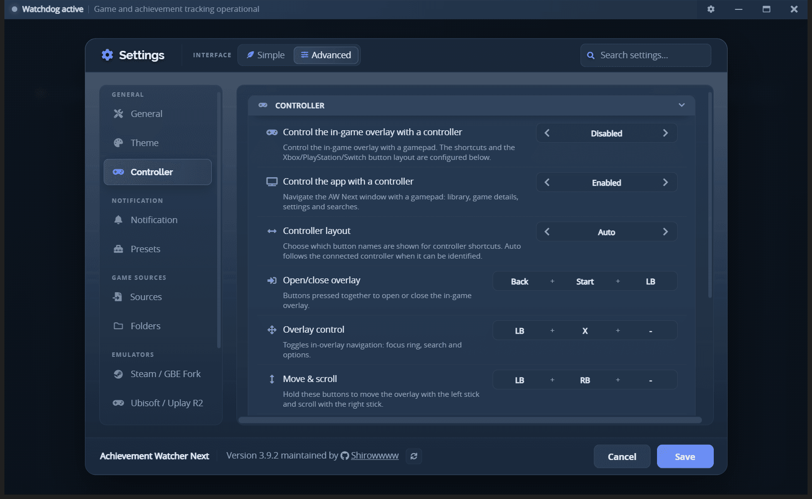

# Controller (gamepad) guide

AW Next can be driven with a gamepad in two independent places: the
main window and the in-game overlay. Both are configured from **Settings →
Controller**.

 
Overlay and app navigation, layout, and per-shortcut button bindings

## The two switches

| Setting | Default | What it covers |
|---|---|---|
| **Control the app with a controller** | On | The main AW Next window: library, game details, settings and searches. |
| **Control the in-game overlay with a controller** | Off | The in-game overlay, driven by the background tracker while you play. |

They are separate on purpose. App navigation is pure renderer input and costs
nothing, so it is on by default. Overlay control loads the native controller
stack in the background tracker, so it is opt-in.

## Shortcuts at a glance

Button names below use the Xbox vocabulary; the app shows them in whichever
layout you select.

| Shortcut | Default | Where |
|---|---|---|
| Open / close the overlay | **Back + Start + LB** | In game |
| Toggle overlay navigation | **LB + X** | Overlay open |
| Move & scroll the overlay | **LB + RB** (held) | Overlay open |
| Confirm | **A** | App + overlay |
| Back / cancel | **B** | App + overlay |
| Focus the search box | **X** | App + overlay |
| Open Settings / overlay options | **Y** | App + overlay |
| Open Settings | **Start** | App |
| Launch the selected game | **RT** | App, library |
| Open Game Health for the selected game | **LT** | App, library |
| Previous / next settings tab | **LB** / **RB** | App, Settings open |
| Scroll the page | **LB** / **RB** | App, Settings closed |

The overlay toggle uses three buttons on purpose, so it cannot fire by accident
mid-game. Every overlay shortcut is configurable and accepts one to three buttons.

In the library the tile itself is what the stick moves between, and **A** opens the
game - the same thing clicking a tile does. The two controls painted on a tile are
on the triggers instead, so no other shortcut had to give up a button: **RT** launches
the selected game and **LT** opens its Game Health panel. Both do nothing unless a
library tile is selected.

## Options

- **Controller layout** - the vocabulary used for hints and button names:
  **Auto** (follows the connected pad when it can be identified), **Xbox**,
  **PlayStation** or **Switch**.
- **Controller backend** - **Auto** picks the best available input backend;
  **XInput** maximizes compatibility; **GameInput** suits newer Windows builds.
- **Bindings** - one to three buttons per shortcut. Shortcuts may share a button:
  the defaults deliberately do (**LB + X** and **LB + RB** both use LB), and the
  input layer resolves the overlap so holding one combo does not fire the other.
  Repeating the same button inside one binding is simply collapsed. The overlay
  toggle also accepts the **Guide** button; the two overlay modes do not, because
  they are read through the browser gamepad API, which does not report it reliably.
- **Focus overlay when it opens** - gives the overlay keyboard focus. Many games
  pause when they lose focus. Off by default.
- **Send Escape to the game when opening with controller** - sends an Escape key
  press to the focused game just before the overlay opens, so many games pause or
  open their menu. It runs only for controller-triggered opens while a game is
  running, never for the keyboard hotkey. Off by default.

## App window

With app navigation enabled, pressing any gamepad button in the main window
raises a focus ring. The D-pad or left stick moves between interactive controls,
and the shortcuts in the table above apply. Two details worth knowing:

- **B** first leaves a focused text field, and only then goes back or cancels, so
  you never have to reach for the mouse to escape the search box.
- **LB** / **RB** switch settings tabs while Settings is open, and scroll the page
  when it is closed.

Moving the mouse or pressing a key on the keyboard returns control to the mouse
and keyboard.

## In-game overlay

**Back + Start + LB** opens or closes the overlay over the running game.
**LB + X** then toggles navigation mode: the D-pad or left stick moves the focus
ring, **A** confirms, **B** cancels, **X** focuses the search and **Y** opens the
options panel. Holding **LB + RB** moves the overlay with the left stick and
scrolls the list with the right stick.

The header shows a small **UI** badge while navigation is active, and the hint
bar always reflects your own bindings and layout - not the defaults. The rest of
the overlay is covered in the [overlay guide](overlay.md).

> [!IMPORTANT]
> **Windows input caveat:** Windows does not let a third-party app capture a
> controller exclusively, so the game may still receive button input while the
> overlay is open. If you want the game to pause, enable **Focus overlay when it
> opens** (most games pause when they lose focus) or **Send Escape to the game
> when opening with controller**.

## Supported pads

Xbox controllers, PlayStation DualShock 4 / DualSense and Switch Pro controllers
are supported. Xbox pads go through XInput; PlayStation and Switch pads are read
over raw HID, which is why they work without any vendor driver.

## When a controller is not detected

1. Confirm the right switch is on - app navigation and overlay control are separate.
2. Try the **XInput** backend explicitly; **Auto** can pick GameInput on a build
   where a given pad is not enumerated.
3. Check the pad in the Windows game-controller panel (`joy.cpl`) first. If Windows
   does not see it, AW Next cannot either.
4. For a bug report, add `debugLogging = true` to the `[controller]` section of
   `%APPDATA%\Achievement Watcher Next\cfg\options.ini` and restart. The background
   tracker then logs button-level controller diagnostics. There is no UI switch for
   it because it is verbose; turn it back off afterwards.

---

**Next:** [Game Health](game-health.md) - the per-game panel that says why a game is
or is not being tracked.

[← Documentation](README.md) · [Overlay guide](overlay.md) · [Project home](https://github.com/Shirowwww/Achievement-Watcher-Next)

