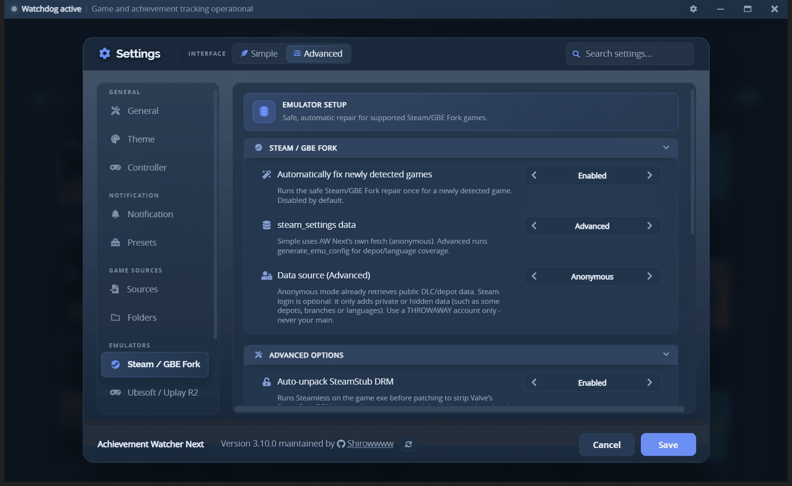
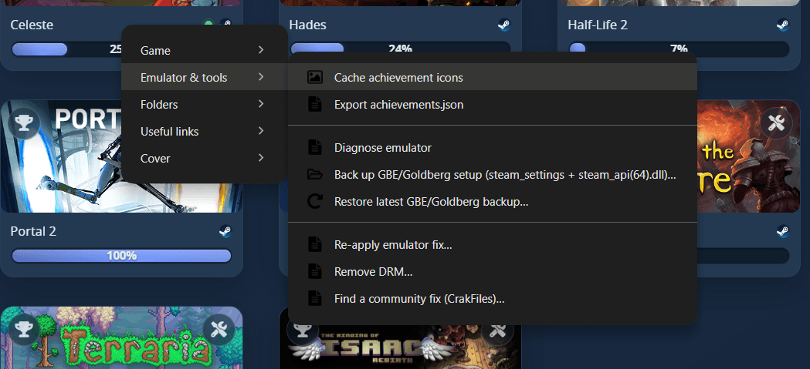

# Goldberg and GBE Fork setup

AW Next can read achievement saves produced by Goldberg, GBE Fork and compatible Steam-emulator layouts. It can also diagnose and repair a game's local emulator configuration when the achievement schema, AppID or runtime files are incomplete.

> [!WARNING]
> The repair tools are optional. They modify files inside the selected game directory, so use them only with games you own and keep any additional backup you consider important.

## Schema and save files are different

Two unrelated files are commonly named `achievements.json`:

| | Schema file | Runtime save file |
|---|---|---|
| Typical location | `<game>\steam_settings\achievements.json` | `%APPDATA%\GSE Saves\<appid>\achievements.json` or `%APPDATA%\Goldberg SteamEmu Saves\<appid>\achievements.json` |
| Written by | The game/emulator setup | The emulator while the game runs |
| Purpose | Defines achievement names, descriptions and icons | Records which achievements have unlocked |
| When missing | In-game achievement handling may be incomplete; AW Next can use another schema source | The game correctly appears at 0% until the first unlock is written |

A schema file does not prove that anything has unlocked. A runtime save that contains no earned entry is a valid 0% state.

## Recommended workflow

1. Add the game library or save root under **Settings → Folders**.
2. Run **Smart Find** or **Generate configs**.
3. If the game appears with missing data, right-click it and open **Emulator & tools → Diagnose**.
4. Read the report before applying a repair.
5. Use **Repair `steam_settings`** for schema or configuration problems.
6. Use **Apply emulator fix (GBE Fork)** only when the game needs a matching runtime DLL as well.
7. Launch the game and unlock an achievement, then refresh AW Next if needed.

Automatic setup for newly discovered games is opt-in under **Settings → Emulators → Steam / GBE Fork**. When disabled, scanning does not perform the full runtime installation in the background.

 
The Steam / GBE Fork tab: automatic repair, schema data mode and the opt-in SteamStub unpacker

## Context-menu actions

 
Right-click a game → Emulator &amp; tools

### Diagnose

Reports the detected emulator type, AppID, `steam_settings` location, schema and save counts, missing entries or icons, custom save paths and AppID mismatches. Diagnosis is read-only.

### Repair `steam_settings`

Offered as a button on the diagnosis report itself when problems were found - it is not a separate context-menu entry. It builds a schema that matches the detected Steam achievement names, refreshes relevant configuration files, writes the AppID when missing, and can download icons. Existing files are snapshotted before replacement.

### Apply emulator fix (GBE Fork)

Downloads and caches a matching GBE Fork release, backs up an existing `steam_api.dll` or `steam_api64.dll`, installs the required architecture and repairs `steam_settings`.

The runtime is installed as a normal DLL replacement. AW Next does not configure a separate ColdClient launcher.

### Using your own emulator DLL

**Settings → Emulators → Emulator DLL** imports your own `steam_api.dll` or `steam_api64.dll` and
installs it instead of the downloaded GBE Fork build, on every fix and every automatic fix. The
architecture you do not import still comes from the official build, as do the interface tools.

An imported file is re-validated on every use: it must be a real PE of the architecture its name
claims, and it must actually be a Steam emulator DLL. A file that fails any of those is reported and
ignored rather than installed. **Use the official build** removes the import and returns to the
downloaded release.

### Remove Steam DRM (Steamless)

Attempts to unpack SteamStub from the selected executable when a DLL replacement cannot load. The original executable is kept as `*.steamstub.bak`. This action is not useful for games without SteamStub and does not bypass server-side ownership checks.

### Back up and restore

Creates a manifest-backed snapshot of the relevant DLL and `steam_settings` files, or restores a previous snapshot. Schema repairs also keep timestamped backups under `steam_settings\.aw-backups`.

## Common problems

### The game is missing

- Start the emulator once so it creates a runtime save, or add the actual game library so install discovery can find `steam_settings`, `steam_appid.txt` or the Steam API DLL.
- Confirm that the folder added to Settings is high enough to contain the game directory, but not an entire drive with unrelated data.
- Run **Generate configs** and review the result count.

### Every achievement remains locked

Check these causes in order:

1. **No achievement has unlocked yet.** An absent or empty runtime save is expected.
2. **Schema names do not match the save keys.** Run **Diagnose**, then repair the schema.
3. **The save path is customized.** Point AW Next at the actual save root or remove the placeholder override.
4. **The AppID is wrong.** Correct the game mapping before writing a new `steam_appid.txt`.

### Descriptions or icons are missing

Run a full repair with icon download enabled. When online metadata is unavailable, AW Next can reuse a valid local schema, but it cannot invent descriptions that are absent from every source.

### In-game notifications are missing but the library updates

The runtime save is being read, but the game's own emulator schema or overlay may be incomplete. Confirm that `steam_settings\achievements.json` contains the same API names as the runtime save and valid icon paths.

## Files a repair may change

- `steam_api.dll` or `steam_api64.dll`, with the original kept as `*.bak`;
- `steam_settings\achievements.json` and its `images` directory;
- `steam_settings\steam_appid.txt` when missing;
- GBE configuration such as `configs.app.ini`, `configs.main.ini` and `configs.user.ini`;
- the selected executable when Steamless is explicitly used.

Review the [technical Goldberg/GBE reference](goldberg-gbe.md) for file formats, detection rules and implementation details.

## Limitations

Some games do not report achievements through Steamworks at all, even when sold on Steam. Those titles cannot be tracked through a Goldberg/GBE save path. AW Next also cannot repair a game whose real identity or achievement schema cannot be resolved safely.

---

**Next:** [Uplay setup, R1 and R2](uplay-r2.md) - the Ubisoft equivalent, for games that do
not load `steam_api.dll`.

*Going deeper: [Goldberg/GBE technical reference](goldberg-gbe.md) for file formats
and detection rules.*

[← Documentation](README.md) · [Technical reference](goldberg-gbe.md) · [Project home](https://github.com/Shirowwww/Achievement-Watcher-Next)

