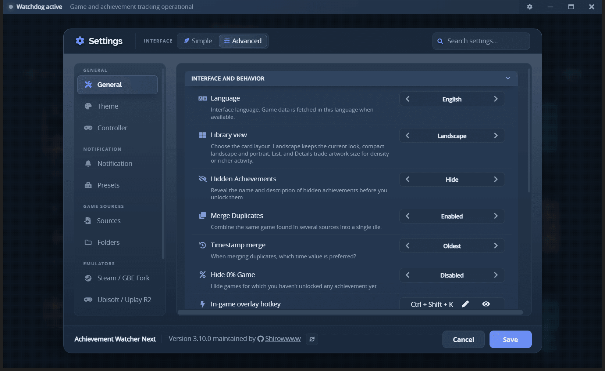
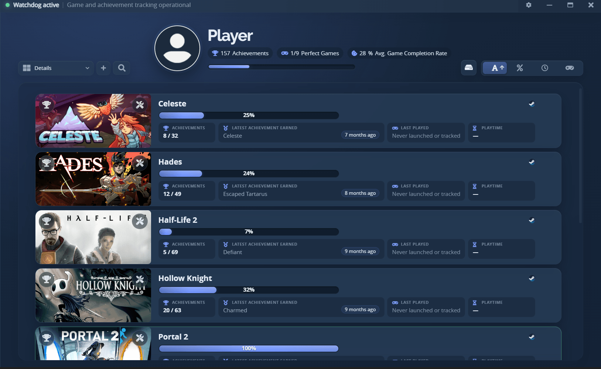

# Getting started

AW Next is a Windows desktop application. Packaged releases include their own runtime, so Node.js is required only when building from source.

## Install

1. Open the [latest release](https://github.com/Shirowwww/Achievement-Watcher-Next/releases/latest).
2. Download `Achievement.Watcher.Setup.<version>.exe`.
3. Run the installer and choose an installation folder.
4. Open AW Next from the Start menu or desktop shortcut.

> [!WARNING]
> The installer is self-signed by `CN=Shirow`. You do not need to install its certificate, and
> in-app updates accept it on a fresh PC while still checking the release SHA-512. Windows
> SmartScreen may nevertheless ask for confirmation because the certificate is not publicly trusted.

## First launch

<div align="center">
<br>
<sub>Six steps: language, how it works, interface, account, games and settings</sub>
</div>

The first-run guide asks for the main choices needed to populate the library:

- **Language** controls the interface and the preferred language for game metadata when the source provides it.
- **Interface** chooses between Simple and Advanced (see below). The guide will not move past this
  step until you pick one - neither is preselected.
- **Sources** enables launcher, local-save and emulator integrations.
- **Folders** tells AW Next where to look for game libraries and achievement saves.
- **Notifications** chooses how unlocks are announced. **Automatic** is the default and needs no
  decision: it uses the in-game overlay when it can be shown and a Windows notification when it cannot.

You can revisit every option later from **Settings**.

## Simple and Advanced

The interface comes in two sizes. Pick one in the first-run guide, and change it whenever you like
from the **Interface** control at the top of **Settings**.

<div align="center">
<br>
<sub>The Interface control sits beside the panel title; the search field filters every tab at once</sub>
</div>

- **Simple** shows the everyday tabs: General, Theme, Controller, Notification, Presets, Sources,
  Folders and Help.
- **Advanced** adds the **Steam / GBE Fork**, **Ubisoft / Uplay R2** and **Advanced** tabs, plus
  the deeper options inside the tabs Simple already shows.

**Simple hides controls, it never turns anything off.** Tracking, scanning and notifications work
the same either way, and every value you set is still there when you switch back.

Per-game **Game Health** follows the same idea: Simple says *Achievement data found* or *Tracking
active*, Advanced gives the exact counts, files and process names. **Technical details** at the
bottom of the panel has the raw values in both.

Upgrading an existing installation lands on **Advanced**, so nothing you were using disappears.

In **Settings → Sources**, the shield marks the official desktop libraries supported directly:
Steam, Ubisoft Connect, GOG Galaxy, Epic Games and Xbox PC. Enable the relevant row and refresh the
library; only libraries detected on the current PC are displayed. Simple mode folds away a few niche
rows while they are unused, and brings them straight back the moment they matter. Every source and
what it needs is listed in [Compatible sources](sources.md).

The selector between the library search and the `+` button switches between six library views -
large cards, portrait covers, their two compact variants, a list, and a dense details table with
playtime and last session. The choice is saved, and every view keeps the same cards, filters and
context menu.

<div align="center">
<br>
<sub>The Details view: latest achievement, last session and playtime for every game at a glance</sub>
</div>

The search field at the top of **Settings** filters every tab at once, and the side menu shows how many options each tab matches - useful when you remember what an option does but not where it lives. It matches labels, descriptions, the values an option offers and its internal name, so `hideZero` finds the same row in any interface language. Press `Ctrl+F` to jump to it and `Esc` to clear it.

## Themes

**Settings → Theme** paints the whole app and the in-game overlay. Thirteen palettes are built in,
and **every one of them can be edited**: pick a theme and the editor below opens on its own colours.
There is one row per layer - window background, top bar, library panel, cards and rows, the settings
window, text, muted text, borders and the accent. Each layer takes a colour with an opacity,
optionally a gradient, and the five surface layers optionally a background image with a fit and
either a coloured veil or a blur.

Editing previews live and writes nothing. **Save theme**, beside the name field, is what turns it
into a theme of your own:

- Leave the name as it opened and you are offered to replace that theme with what the editor shows.
- Type another name and you get a second theme, with the first left exactly as it was.
- A saved theme sits in the picker like any built-in, exports as an `.awtheme` and can be deleted.

**Custom…** is the scratch slot: always there, always editable, and never overwritten by a save made
from it. **Reset all** puts back the theme you are editing - a built-in returns its own palette, a
saved or imported theme returns what is on disk, and the Custom slot returns to the default palette.

Below the picker, **Theme files** turns whatever you are using into one portable file:

- **Export theme…** writes an `.awtheme`: the palette, the gradients, the effect settings and any
  image you used, in a single file. It carries nothing about your machine - an image travels as
  bytes under a name built from its layer, never as a path out of your pictures folder. A built-in
  keeps its name, so exporting one is refused until you save it under a name of your own: the file
  would otherwise install as "Nord" on somebody else's machine and shadow the Nord they have.
- **Import theme…** reads one. Before anything is installed it shows the app drawn with that theme,
  with the name, the author, the version and how many images it carries, and only installs it when
  you confirm. An imported theme then behaves exactly like a built-in: it sits in the same dropdown,
  paints the same surfaces and follows into the overlay.
- **Delete theme** removes an imported one, with its images and its generated copies.

An `.awtheme` contains no stylesheet, no markup and no script - it is colours, numbers and pictures,
and the app builds its own stylesheet from them - so an imported theme has nothing it could run and
no way to reach the network. The details are in [the format reference](awtheme-format.md).

Themes other people have made are in the [theme gallery](gallery/themes/); sending yours is
[one file](community-galleries.md).

A plain `*.css` dropped into `%APPDATA%\Achievement Watcher Next\themes` still appears in the picker
as a user theme and is injected over the built-in stylesheet. That kind cannot be exported: sharing
somebody else's stylesheet is exactly what the portable format is designed not to do.

## Help & tips adapts to your setup

The **Settings → Help** tab is a live reference, not a static page:

- The strip at the top shows your current theme, notification mode, controller
  state, overlay hotkey and how many sources are enabled.
- Controller instructions follow the selected layout (**Xbox**, **PlayStation**
  or **Switch**) and show your real bindings, including the three-button
  open/close combo.
- Keyboard-shortcut entries show the hotkey actually saved instead of a
  hard-coded default.
- The topic search ignores case and accents. Several matches stay as a compact
  list; a single match opens immediately.
- Every topic is available in both interface modes: reading about a feature
  never requires switching modes first.

The panel refreshes immediately as you change settings, so it doubles as a
preview before you press **Save**.

## Steam metadata, keyless by design

No Steam Web API key and no connected Steam account are used: each game's achievement list is
fetched automatically from public endpoints and cached per language, so the library keeps working
offline afterwards. [Compatible sources](sources.md#steam-metadata-without-an-api-key) explains the
lookup chain, the DLC and update tags, and the 3-day recheck.

## Find games and saves

Open **Settings → Folders** and choose one of these paths:

- **Smart Find** finds folders two ways, and offers everything it finds for approval before adding
  anything. It recognises library folders by name ("Games", "Jeux", "Repacks" and their equivalents
  in twenty-odd languages, plus "Emulators" and "Emulation") on every drive, **and** it reads what
  the launchers themselves recorded - the Epic manifests, the GOG Galaxy and Ubisoft Connect registry
  entries, and the pointer Windows writes for the drive you chose for Xbox games. That second route
  is how a library named after a storefront (`D:\Epic Games`, `D:\XboxGames`) is found without
  scanning anything. Games the launcher owns keep their own source; what this adds is everything else
  sitting in the same folder, which is usually where a repack or a Goldberg build ends up.
- **Add a Folder** watches a location you select.
- **Generate configs** performs a fuller scan and can apply enabled emulator setup options.

If a folder is rejected, select the directory that directly contains the supported save folders, AppID folders, `steam_settings`, or the relevant emulator configuration. The [troubleshooting guide](troubleshooting.md#a-game-is-missing) lists the first checks to make.

## Configure notifications

Open **Settings → Notification** and choose a delivery mode:

- **Automatic** (default) uses the in-game overlay when it can be shown, and a Windows notification
  when it cannot - for example while a game holds exclusive fullscreen, where an overlay popup would
  not be visible. The same unlock is never announced twice.
- **In-game overlay** always displays a styled popup over the running game.
- **Windows notification** always uses native Windows notifications.
- **Both** enables both transports.

The [notifications guide](notifications.md#how-automatic-decides) explains what Automatic looks at,
and a game's **Game Health** panel reports which transport actually delivered its last notification.

If Windows Do Not Disturb normally hides desktop notifications while playing, enable **Priority
notifications** in the same section and approve the one-time Windows request. This affects achievement
unlocks, not progress or playtime updates.

Use the test buttons before launching a game. Presets, sounds, volume, duration and position can all be changed later. See [Notifications](notifications.md) for details.

## Check on a game

Every game tile has a **tools** button that opens its **Game Health** panel: whether AW Next can see
the game, read its achievements and announce its unlocks - and the repairs that genuinely apply to
that game. It is the fastest answer to "why is this one not working", and the first thing to open
before reporting a problem. See [Game Health](game-health.md).

Playing a game through again from zero is [Reset achievements](advanced.md#reset-a-games-achievements),
which backs everything up first.

## Tray and startup behavior

Closing the main window normally keeps AW Next in the system tray. The background tracker continues watching supported files and processes for playtime and unlocks.

Starting with Windows and closing to the tray can be changed under **Settings → General**. To exit fully, use the tray menu.

## Updates and existing data

Installed releases check the project's GitHub release feed for a newer version. When one is found, the app asks first whether you want to download and install it - nothing is downloaded without your OK. Once the download finishes, it asks again before restarting to apply the update.

A chip beside the Watchdog indicator in the title bar follows the whole thing: *Update available*,
then the percentage as it downloads, then *Update Ready*, then *Installing update…*. While the file
is downloading the chip carries a **Cancel**, which is the way to stop a download you started by
mistake without quitting the app. Open the window halfway through a background download and the chip
is already showing it. If a game is running when the update is ready, the chip says so and the
install waits until the game closes.

The installer itself runs with its own progress window and asks nothing along the way, so there is
something to watch from the moment AW Next closes until it comes back.

Installing a newer build over an older one replaces program files but preserves user data in:

```text
%APPDATA%\Achievement Watcher Next
```

This directory contains settings, watched folders, caches, playtime, logs, notification assets and local account data.

On the first launch after upgrading, AW Next imports your existing data into it:

| You are coming from | Imported from | What happens |
|---|---|---|
| Achievement Watcher 3.x | `%APPDATA%\Achievement Watcher 3.0` | Settings, presets, themes, covers, caches, backups and logs are carried over |
| Achievement Watcher 1.6.8 | `%APPDATA%\Achievement Watcher` | Same, for anyone who skipped 3.x |
| A fresh machine | nothing | AW Next starts with defaults |

The import runs once, copies small files and hard-links the large write-once ones, and **never deletes or modifies the folder it read from** - if anything goes wrong, your old data is still exactly where it was. Playtime counters stored in the registry are carried across the same way. Screenshot souvenirs move to `Pictures\Achievement Watcher Next`, unless you chose your own souvenir folder, in which case it is left untouched.

Uninstalling does not remove the data directory by default. Delete it manually only when you intentionally want a completely fresh profile.

If an update keeps failing on the same downloaded file, **Settings → Advanced → Clear caches**
deletes only re-downloadable caches (update files, Steam/Ubisoft schema and icon cache, downloaded
emulator-fix tools) and lets everything re-fetch itself; settings, saves and backups are untouched.

---

**Next:** [Compatible sources](sources.md) - what AW Next can read, and what each source needs.

*Jump ahead if you already know what you need: [Notifications](notifications.md) ·
[Game Health](game-health.md) · [Goldberg / GBE setup](emulator-setup.md) ·
[Troubleshooting](troubleshooting.md)*

<div align="center">

[← Documentation](README.md) · [Project home](https://github.com/Shirowwww/Achievement-Watcher-Next)

</div>