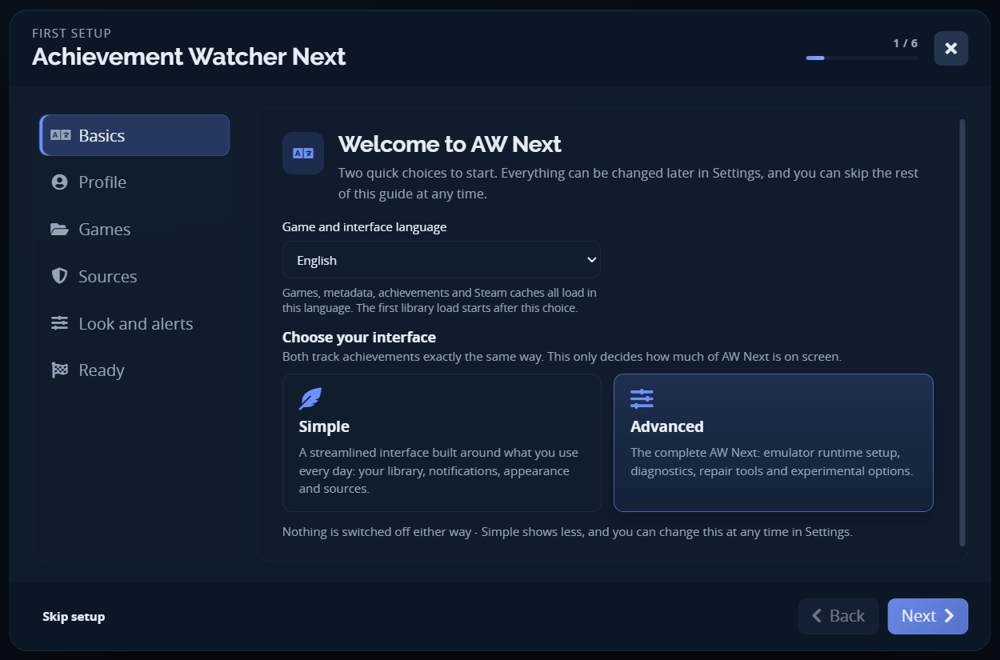
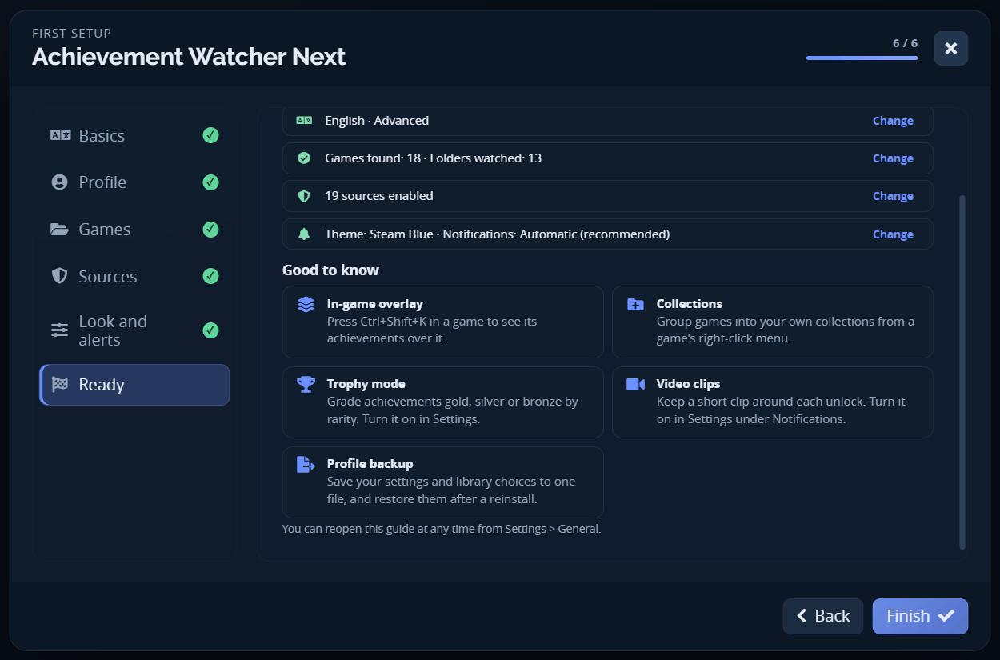
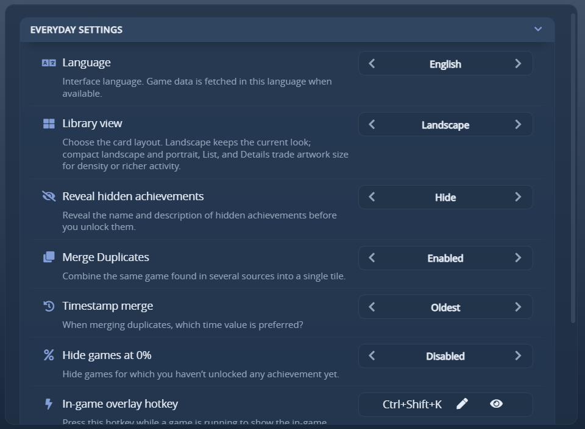
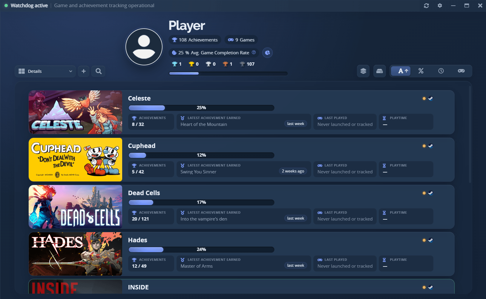
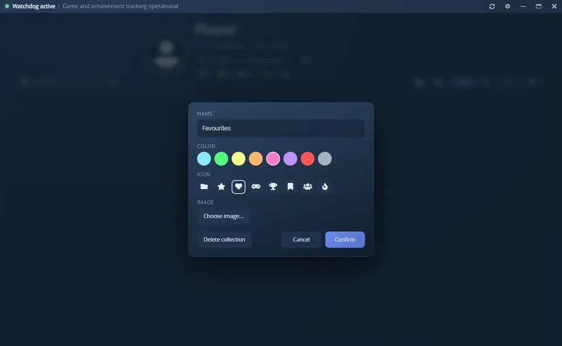
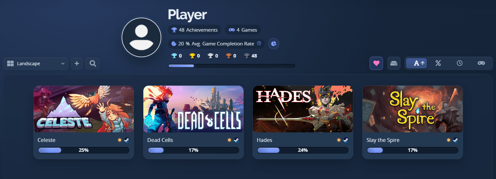
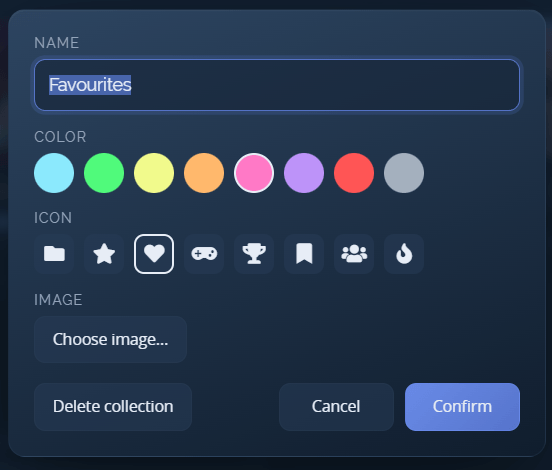
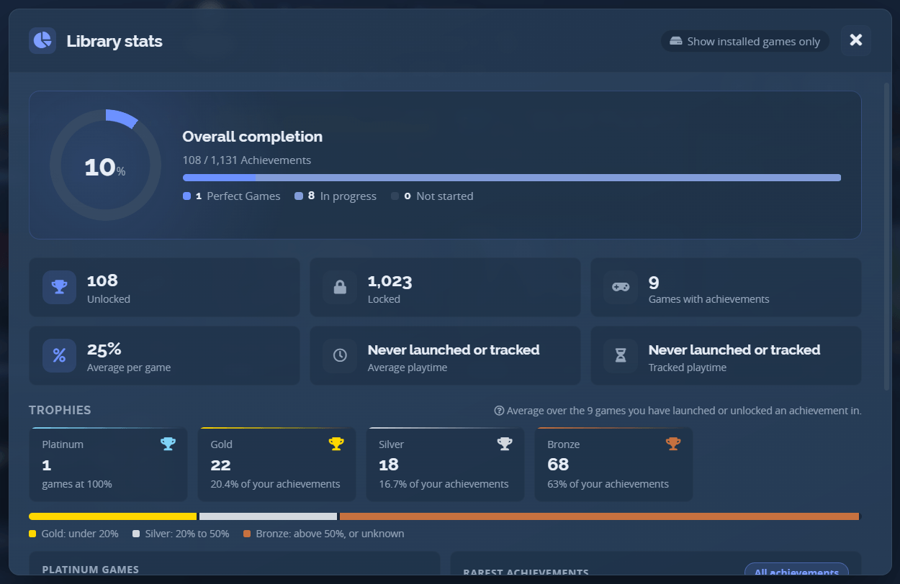
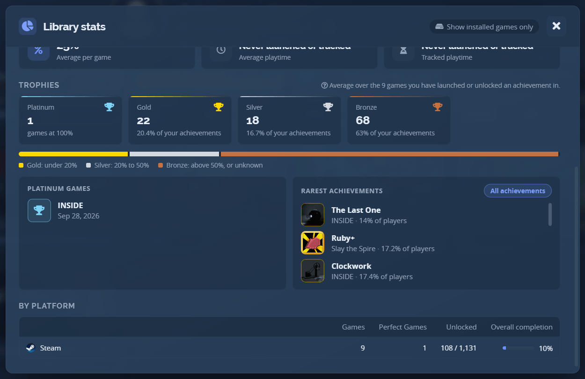

# Getting started

AW Next is a Windows desktop application. Packaged releases include their own runtime, so Node.js is required only when building from source.

## Install

1. Open the [latest release](https://github.com/Shirowwww/Achievement-Watcher-Next/releases/latest).
2. Download `Achievement.Watcher.Setup.<version>.exe`.
3. Run the installer and choose an installation folder.
4. Open AW Next from the Start menu or desktop shortcut.

Prefer no installer? Download `Achievement.Watcher.Portable.<version>.zip` instead and extract it
anywhere; its data stays in a `data` folder beside the executable.

> [!WARNING]
> The installer is signed with the project's own self-signed certificate (`CN=Shirow`), so Windows
> SmartScreen may still ask for confirmation - see
> [Antivirus or SmartScreen warning](troubleshooting.md#antivirus-or-smartscreen-warning). In-app
> updates only ever install a release signed by that same certificate, pinned by thumbprint, so a
> tampered release cannot install itself.

## First launch

<div align="center">
<picture><source srcset="assets/shot/onboarding-dialog-800.webp 800w, assets/shot/onboarding-dialog.webp 1250w" sizes="(max-width: 700px) 100vw, 720px"></picture><br>
<sub>Six steps: basics, profile, games, sources, look and alerts, and a final recap</sub>
</div>

The first-run guide asks for the main choices needed to populate the library:

- **Basics** are the language and the interface. The language controls the interface and the
  preferred language for game metadata when the source provides it. The interface chooses between
  Simple and Advanced (see below); the guide will not move past this step until you pick one -
  neither is preselected.
- **Profile** is the name shown in the header, an optional local avatar and your main Steam account.
- **Games** reports what was found on this PC: the installed Steam, GOG, Epic and Ubisoft games, and
  the games inside every emulator folder it finds, with a count. Add a folder only if something is
  missing.
- **Sources** signs in to Steam, Epic or Xbox (optional) to read your real library - including games
  shared with you through Steam Family - and unlocks made on another PC. You can skip this and
  connect later from **Settings → Sources**. Every source switch is still there under **Fine-tune
  sources**, folded away because the defaults read whatever is installed.
- **Look and alerts** picks the theme and how unlocks are announced, with a **Test notification**
  button. **Automatic** is the default and needs no decision: it uses the in-game overlay when it can
  be shown and a Windows notification when it cannot.
- **Ready** recaps your choices, each with a **Change** button, and points at collections, trophy
  mode, video clips and the in-game overlay.

<div align="center">
<picture><source srcset="assets/shot/onboarding-ready-dialog-800.webp 800w, assets/shot/onboarding-ready-dialog.webp 1250w" sizes="(max-width: 700px) 100vw, 720px"></picture><br>
<sub>The last step: each choice with its Change button, then one card per feature worth knowing about</sub>
</div>

**Skip setup** is always available: it keeps what you have answered, leaves the rest as it was and
starts the first scan. You can revisit every option later from **Settings**, and reopen the guide
from **Settings → General**.

## Simple and Advanced

The interface comes in two sizes. Pick one in the first-run guide, and change it whenever you like
from the **Interface** control at the top of **Settings**.

<div align="center">
<picture><source srcset="assets/shot/settings-panel-800.webp 800w, assets/shot/settings-panel.webp 960w" sizes="(max-width: 700px) 100vw, 720px"></picture><br>
<sub>The Interface control sits beside the panel title; the search field filters every tab at once</sub>
</div>

- **Simple** shows the everyday tabs: General, Theme, Controller, Notification, Notification presets, Sources,
  Folders and Help.
- **Advanced** adds the **Steam / GBE Fork**, **Ubisoft / Uplay R1/R2** and **Advanced** tabs, plus
  the deeper options inside the tabs Simple already shows.

**Simple hides controls, it never turns anything off.** Tracking, scanning and notifications work
the same either way, and every value you set is still there when you switch back.

Per-game **Game Health** follows the same idea: Simple says *Achievement data found* or *Tracking
active*, Advanced gives the exact counts, files and process names. **Technical details** at the
bottom of the panel has the raw values in both.

Upgrading an existing installation lands on **Advanced**, so nothing you were using disappears.

In **Settings → Sources**, the shield marks the official desktop libraries supported directly:
Steam, Ubisoft Connect, GOG Galaxy, Epic Games and Xbox PC. Enable the relevant row and refresh the
library; only libraries detected on the current PC are displayed. Simple mode folds away a few niche
rows while they are unused, and brings them straight back the moment they matter. Every source and
what it needs is listed in [Compatible sources](sources.md).

The selector between the library search and the `+` button switches between six library views -
large cards, portrait covers, their two compact variants, a list, and a dense details table with
playtime and last session. The choice is saved, and every view keeps the same cards, filters and
context menu.

<div align="center">
<picture><source srcset="assets/shot/library-views-800.webp 800w, assets/shot/library-views.webp 1280w" sizes="(max-width: 700px) 100vw, 800px"></picture><br>
<sub>The Details view: latest achievement, last session and playtime for every game at a glance</sub>
</div>

**Settings → Theme → Library tiles** adds a **Tile size** slider for the artwork and a **Space
between tiles** slider for the grid gap (down to 0 for no gaps at all), plus a show/hide switch for
the game name, progress bar, platform icon, health dot, achievements button and settings button -
one set of switches, applied to every view.

The search field at the top of **Settings** filters every tab at once, and the side menu shows how
many options each tab matches - for when you remember what an option does but not where it lives. It
matches labels, descriptions, the values an option offers and its internal name, so `hideZero` finds
the same row in any interface language. `Ctrl+F` jumps to it, `Esc` clears it.

## Collections

Collections are your own groups of games. Right-click a game, choose **Collections** and tick one,
or make a new one from the same menu. The collections button next to the installed-only toggle
then filters the library to a single collection, and the profile numbers above it follow suit.

<div align="center">
<br>
<sub>Create a collection, add games from their right-click menu, then filter the library by it</sub>
</div>

<div align="center">
<picture><source srcset="assets/shot/collections-panel-800.webp 800w, assets/shot/collections-panel.webp 1280w" sizes="(max-width: 700px) 100vw, 800px"></picture><br>
<sub>Viewing one collection: the button takes its icon and colour, and the totals count only its games</sub>
</div>

Each collection has a name, a colour and an icon, or a picture of your own. **Edit collection…** in
the button's menu opens the editor, which is also where a collection is deleted; its games stay in
the library.

<div align="center">
<picture><source srcset="assets/shot/collection-editor.webp 552w" sizes="(max-width: 700px) 100vw, 360px"></picture><br>
<sub>The collection editor</sub>
</div>

## Library stats

The round button beside the completion rate in the profile header opens **Library stats**: the whole
library on one screen. It shows overall completion, how many achievements are unlocked and locked,
the average per game, average and tracked playtime, and the trophy counts, with one row per
platform at the bottom. **Show installed games only** limits the totals to what is on this PC.

<div align="center">
<picture><source srcset="assets/shot/stats-overview-800.webp 800w, assets/shot/stats-overview.webp 1250w" sizes="(max-width: 700px) 100vw, 800px"></picture><br>
<sub>The overview: completion, counts, average per game and playtime</sub>
</div>

**Trophies** counts platinum for each finished game and grades every other unlocked achievement by
its rarity, with the thresholds listed under the bar (they follow the rarity setting in
[Notifications](notifications.md#trophy-mode)). **Platinum games** lists the games you finished and when,
**Rarest achievements** the hardest ones you hold, and **All achievements** opens the complete list.

<div align="center">
<picture><source srcset="assets/shot/stats-trophies-800.webp 800w, assets/shot/stats-trophies.webp 1250w" sizes="(max-width: 700px) 100vw, 800px"></picture><br>
<sub>Trophies, platinum games, rarest unlocks and the totals per platform</sub>
</div>

## Themes

**Settings → Theme** paints the whole app and the in-game overlay. Thirteen palettes are built in,
and **every one of them can be edited**: pick a theme and the editor below opens on its own colours.
There is one row per layer - window background, top bar, library panel, cards and rows, the settings
window, text, muted text, borders and the accent. Each layer takes a colour with an opacity,
optionally a gradient, and the five surface layers optionally a background image with a fit and
either a coloured veil or a blur.

Editing previews live and writes nothing. **Save theme**, beside the name field, is what turns it
into a theme of your own: keep the name it opened with to replace that theme, or type another name
to get a second one and leave the first untouched. A saved theme sits in the picker like any
built-in, exports as an `.awtheme` and can be deleted.

**Custom…** is the scratch slot: always there, always editable, and never overwritten by a save made
from it. **Reset all** puts back the theme you are editing - a built-in returns its own palette, a
saved or imported theme returns what is on disk, and the Custom slot returns to the default palette.

Below the picker, **Theme files** turns whatever you are using into one portable file:

- **Export theme…** writes an `.awtheme` - palette, gradients, effect settings and any image you
  used - and carries nothing about your machine: an image travels as bytes, never as a path out of
  your pictures folder. Exporting a built-in is refused until you save it under a name of your own,
  since the file would otherwise install as "Nord" elsewhere and shadow the Nord already there.
- **Import theme…** shows the app drawn with that theme first, with its name, author, version and
  image count, and installs only when you confirm. An imported theme then behaves like a built-in.
- **Delete theme** removes an imported one, with its images and its generated copies.

An `.awtheme` contains no stylesheet, no markup and no script - only colours, numbers and pictures,
from which the app builds its own stylesheet - so it has nothing it could run and no way to reach
the network. The details are in [the format reference](awtheme-format.md).

Themes other people have made are in the [theme gallery](gallery/themes/); sending yours is
[one file](community-galleries.md).

A plain `*.css` dropped into `%APPDATA%\Achievement Watcher Next\themes` still appears in the picker
as a user theme and is injected over the built-in stylesheet. That kind cannot be exported: sharing
somebody else's stylesheet is exactly what the portable format is designed not to do.

## Help & tips adapts to your setup

The **Settings → Help** tab is a live reference, not a static page. Its topics are grouped the way a
question arrives - **Get started**, **Something is wrong**, **Emulated games**, **Make it yours** -
and the strip above them shows your current theme, notification mode, controller state, overlay
hotkey and how many sources are enabled.

- Controller instructions follow the selected layout (**Xbox**, **PlayStation** or **Switch**) and
  show your real bindings, including the three-button open/close combo.
- Keyboard-shortcut entries show the hotkey actually saved instead of a hard-coded default.
- The topic search ignores case and accents, and hides a group once none of its topics match. A
  single match opens immediately.
- Every topic is available in both interface modes: reading about a feature never requires switching
  modes first.

The panel refreshes as you change settings, so it doubles as a preview before you press **Save**.

## Steam metadata, keyless by design

No Steam Web API key is required: each game's achievement list is fetched automatically from public
endpoints and cached per language, so the library keeps working offline afterwards. Connecting a
Steam account (see [First launch](#first-launch) above) is optional and only changes which games and
unlocks the app can see - it is never needed to read achievement names, descriptions or artwork.
[Compatible sources](sources.md#steam-metadata-without-an-api-key) explains the lookup chain, the DLC
and update tags, and the 3-day recheck.

## Find games and saves

Open **Settings → Folders** and choose one of these paths:

- **Smart Find** looks two ways and offers everything it finds for approval before adding anything.
  It recognises library folders by name ("Games", "Jeux", "Repacks" and their equivalents in
  twenty-odd languages, plus "Emulators" and "Emulation") on every drive, **and** it reads what the
  launchers recorded themselves - the Epic manifests, the GOG Galaxy and Ubisoft Connect registry
  entries, and the pointer Windows writes for the drive you chose for Xbox games. That second route
  finds a library named after a storefront (`D:\Epic Games`, `D:\XboxGames`) without scanning
  anything. Games the launcher owns keep their own source; what this adds is everything else in the
  same folder, which is usually where a repack or a Goldberg build ends up.
- **Add a Folder** watches a location you select.
- **Generate configs** performs a fuller scan and can apply enabled emulator setup options.

If a folder is rejected, select the directory that directly contains the supported save folders, AppID folders, `steam_settings`, or the relevant emulator configuration. The [troubleshooting guide](troubleshooting.md#a-game-is-missing) lists the first checks to make.

When a folder name matches several Steam releases and the automatic match picks the wrong one,
right-click the game and choose **Set AppID manually...** - see
[Set a game's AppID by hand](advanced.md#set-a-games-appid-by-hand).

## Configure notifications

Open **Settings → Notification** and choose a delivery mode:

- **Automatic** (default) uses the in-game overlay when it can be shown, and a Windows notification
  when it cannot - for example while a game holds exclusive fullscreen, where an overlay popup would
  not be visible. The same unlock is never announced twice.
- **In-game overlay** always displays a styled popup over the running game.
- **Windows notification** always uses native Windows notifications.
- **Both** enables both transports.

The [notifications guide](notifications.md#how-automatic-decides) explains what Automatic looks at,
and a game's **Game Health** panel reports which transport actually delivered its last notification.

If Windows Do Not Disturb normally hides desktop notifications while playing, enable **Priority
notifications** in the same section and approve the one-time Windows request. This affects achievement
unlocks, not progress or playtime updates.

Use the test buttons before launching a game. Presets, sounds, volume, duration and position can all be changed later. See [Notifications](notifications.md) for details.

## Check on a game

Every game tile has a **tools** button that opens its **Game Health** panel: whether AW Next can see
the game, read its achievements and announce its unlocks - and the repairs that genuinely apply to
that game. It is the fastest answer to "why is this one not working", and the first thing to open
before reporting a problem. See [Game Health](game-health.md).

Playing a game through again from zero is [Reset achievements](advanced.md#reset-a-games-achievements),
which backs everything up first.

## Tray and startup behavior

Closing the main window normally keeps AW Next in the system tray. The background tracker continues watching supported files and processes for playtime and unlocks.

With no window open, AW Next hands the memory it was using back to Windows instead of holding it for the rest of the session, and the periodic library scan waits while a game is running rather than competing with it. A game installed mid-session is picked up shortly after you stop playing. Settings → Advanced → **Automatic achievement data updates** turns that periodic scan off, for anyone who maintains `steam_cache` by hand; **Recheck achievement lists** still works as a one-off check.

Starting with Windows and closing to the tray can be changed under **Settings → General**. To exit fully, use the tray menu.

## Updates and existing data

Installed releases check the project's GitHub release feed for a newer version. When one is found, the app asks first whether you want to download and install it - nothing is downloaded without your OK. Once the download finishes, it asks again before restarting to apply the update.

An update downloads only what changed since the installed version, instead of the whole installer; if
that ever fails it falls back to the full download on its own.

A chip beside the Watchdog indicator in the title bar follows the whole thing: *Update available*,
the percentage as it downloads, *Update Ready*, then *Installing update…*. While the file downloads
the chip carries a **Cancel**, so a download started by mistake can be stopped without quitting the
app. If a game is running when the update is ready, the chip says so and the install waits until the
game closes. The installer then runs with its own progress window and asks nothing along the way.

Installing a newer build over an older one replaces program files but preserves user data in:

```text
%APPDATA%\Achievement Watcher Next
```

This directory contains settings, watched folders, caches, playtime, logs, notification assets and local account data.

On the first launch after upgrading, AW Next imports your existing data into it:

| You are coming from | Imported from | What happens |
|---|---|---|
| Achievement Watcher 3.x | `%APPDATA%\Achievement Watcher 3.0` | Settings, presets, themes, covers, caches, backups and logs are carried over |
| Achievement Watcher 1.6.8 | `%APPDATA%\Achievement Watcher` | Same, for anyone who skipped 3.x |
| A fresh machine | nothing | AW Next starts with defaults |

The import runs once, copies small files and hard-links the large write-once ones, and **never deletes or modifies the folder it read from** - if anything goes wrong, your old data is still exactly where it was. Playtime counters stored in the registry are carried across the same way. Screenshot souvenirs move to `Pictures\Achievement Watcher Next`, unless you chose your own souvenir folder, in which case it is left untouched.

Uninstalling offers one option, off by default: **Also delete settings, cache and saved data** (also
`--delete-app-data` on a silent uninstall), which removes the data directory above along with its
registry playtime. Leave it unchecked to keep everything for a later reinstall, and delete the
directory by hand only when you intentionally want a completely fresh profile.

If an update keeps failing on the same downloaded file, **Settings → Advanced → Clear caches**
deletes only re-downloadable caches (update files, Steam/Ubisoft schema and icon cache, downloaded
emulator-fix tools) and lets everything re-fetch itself; settings, saves and backups are untouched.

---

**Next:** [Compatible sources](sources.md) - what AW Next can read, and what each source needs.

*Jump ahead if you already know what you need: [Notifications](notifications.md) ·
[Game Health](game-health.md) · [Goldberg / GBE setup](emulator-setup.md) ·
[Troubleshooting](troubleshooting.md)*

<div align="center">

[← Documentation](README.md) · [Project home](https://github.com/Shirowwww/Achievement-Watcher-Next)

</div>
