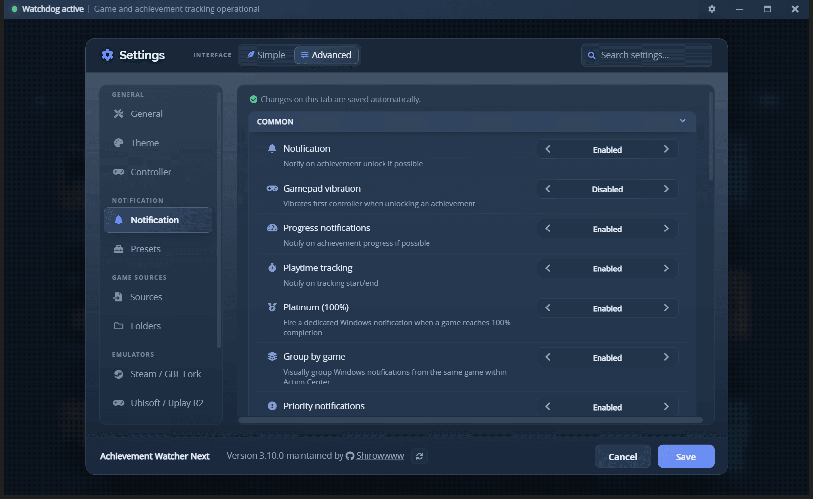
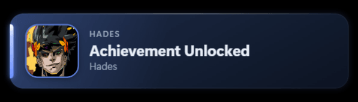

# Notifications

AW Next announces an unlock with a native Windows notification (toast), an in-game overlay popup, or
both. Choose how under **Settings → Notification**.

 
One delivery mode, one preset - Automatic handles the rest

## Choose a delivery mode

| Mode | Behavior |
|---|---|
| **Automatic** (default) | Uses the in-game overlay when it can be shown, and a Windows notification when it cannot. Nothing to configure. |
| **In-game overlay** | Always opens the styled popup above the running game, including in exclusive fullscreen where it may not be visible. If the overlay reports that it could not display at all, that one notification still arrives as a Windows notification rather than being lost. |
| **Windows notification** | Always uses the Windows system notification. Achievement and progress notifications use the achievement icon; playtime notifications can include game artwork and a progress bar. |
| **Both** | Sends the same event to both transports. |

The main library window may stay closed in every mode: the background tracker handles delivery.

 
The overlay popup, drawn by the selected preset with the game's own artwork

Independently of the mode, **Websocket @localhost:8082** broadcasts every notification event as JSON
on a local websocket, for stream overlays and other external tooling. It is on by default, listens on
`127.0.0.1` only - so nothing on the network can read it - and adds no visible notification of its
own. Turn the row off if you do not use it.

> [!TIP]
> Use the built-in test buttons after changing the mode. A successful test confirms the display path;
> a real unlock still depends on the relevant game source being watched correctly.

### How Automatic decides

Each notification is routed once, from what AW Next can actually observe at that moment:

| Situation | What happens |
|---|---|
| Nothing covering the screen | In-game overlay. |
| The game holds **exclusive fullscreen** (Direct3D) | Windows notification - an always-on-top popup is not drawn over an exclusive fullscreen game, so it would play invisibly. Borderless and windowed games keep the overlay. |
| The app reports it cannot display the popup (no usable preset, renderer unavailable) | That notification is sent as a Windows notification instead. |
| The overlay fails to display | Automatic stays on Windows notifications for ten minutes, then tries the overlay again. |
| The overlay was asked but never reported back | No second notification is sent - a duplicate is worse than a delayed switch - and the next unlock uses a Windows notification. |

AW Next remembers which transport last delivered for each game and uses it only as a tie-breaker,
when Windows cannot answer whether a game is in exclusive fullscreen. A live answer always wins over
what was remembered, so a game never gets stuck on the wrong transport.

The transport is chosen **before** anything is sent, and a fallback is only ever allowed when the
primary transport reported a definite failure. The same unlock is therefore never announced twice.

> [!NOTE]
> Exclusive fullscreen is respected rather than worked around: AW Next does not inject into games or
> force display-mode changes to put a popup on top of one.

### Where the current state is shown

Open a game and check its **Game Health** panel. The Notifications row reports the transport that
actually delivered the last notification for that game and why - for example *Working - Windows
fallback active* in Simple mode, or *Windows notification · game in exclusive fullscreen* in
Advanced. Until a game has had a notification, the row shows the configured mode instead of claiming
an observation that has not happened. See [Game Health](game-health.md).

## Priority Windows notifications

Full-screen games and other automatic Windows rules can turn on **Do Not Disturb**, which sends
ordinary toasts to Notification Center without showing them on screen. Enable **Settings →
Notification → Priority notifications** to mark achievement unlocks as important. Windows then asks
once whether AW Next may send those notifications; you can allow or refuse it in Windows notification
settings.

This is deliberately off by default. It applies to achievement and completion unlocks only, never to
progress or playtime updates. The underlying Windows toast uses the `urgent` scenario, supported on
Windows 10 version 2004 and later, and remains subject to Windows' notification permission and system
policy. See [Microsoft's app-notification documentation](https://learn.microsoft.com/en-us/windows/apps/develop/notifications/app-notifications/app-notifications-content).

## How the popup looks

The look of the in-game popup is a **preset**: nine ship with the app, you can design your own with
ordinary controls, and a preset can be shared as a single `.awpreset` file.

→ **[Presets and the Preset Designer](presets.md)**

## Sounds, volume and duration

- Import `.wav`, `.mp3`, `.ogg`, `.flac`, `.m4a` or `.aac` files from the Notification settings.
- **Random** is an entry in the sound list, picked like any other sound: choose it and every
  notification plays a different file from the ones you have. It previews like any other choice too -
  selecting it, moving the volume slider under it or firing a test all play a real sound, a different
  one each time.
- Overlay volume ranges from 0% to 200%. Values above 100% apply an overlay-side boost; Windows
  notification playback is limited by the system audio path.
- Duration can follow the preset automatically or use a fixed cap.
- Playtime notifications are silent by design.

A preset someone shared with you can carry its own sound, which is used instead of the one selected
here. See [Share a preset](presets.md#share-a-preset).

## Position and scale

Choose a corner, edge or centered position from the Notification settings. Positions are measured
against the whole screen, so a bottom anchor sits on the bottom edge rather than above the taskbar,
matching the layout shown in the preset builder. The custom position can be moved with
**Reposition** and is stored for later sessions; it is used exactly as you left it, and a position
saved on a monitor that is no longer connected is brought back into view.

The scale setting resizes the whole popup without changing the preset's layout: every preset is drawn
exactly as it is at 100%, only larger or smaller. **Reposition** shows the popup at the selected
scale, so what you place is what you get.

The in-game overlay list also supports keyboard shortcuts for moving, snapping and click-through -
see the [Overlay guide](overlay.md#keyboard-shortcuts-overlay-open) - plus optional gamepad control,
covered in the [Controller guide](controller.md).

## Per-game behavior

Open a game's tools panel and choose **Notification** to give that game a different popup preset,
position, sound or scale. Every field inherits the global setting by default, and only the values you
change for that game are stored; sound also offers explicit silence and random choices. The crosshair
beside Position drags a preview where that game's popup should appear, without moving the global
position or another game's. The five test buttons preview that game, its artwork and every selection
currently shown, without changing achievement progress. A preset or sound that is removed falls back
to the global value, and renaming a user preset in the designer keeps its game assignments.

Right-click a game to mute its progress notifications without disabling achievement unlocks or
completion notifications. A duplicate guard also prevents the same unlock from appearing twice when a
watched save is rewritten.

Achievements with a global unlock rate below the rare threshold display their rarity percentage and
are drawn in the preset's rare styling.

## Screenshot souvenirs

**Screenshot on unlock** saves a picture of the screen a moment after an achievement pops, so the
notification itself is in the shot. Files land in `<folder>\<game>\<date> - <achievement>.png`, and
**Open folder** in the same row takes you straight there - creating the folder first if nothing has
been saved yet. The folder defaults to `Pictures\Achievement Watcher Next` and can be changed at any
time; the button shows the one in use.

Several achievements unlocking in the same second each keep their own file, and a game whose title
Windows refuses as a folder name is handled rather than silently losing its screenshots.

### Playing with Windows HDR on

**HDR screenshots** defaults to **Automatic**. At capture time, AW Next checks whether HDR is active
on the primary display. If it is, a small one-shot helper captures an FP16 frame through Windows
Graphics Capture and tone-maps its highlights into an ordinary SDR/sRGB PNG. The helper exits as
soon as that one image is written; it does not keep a recorder, GPU session or Electron window alive.

When Windows HDR is off, **Automatic** uses the same standard capture path as before. **Off** always
uses that standard path. Missing Windows support, a blocked capture, a timeout or any other helper
failure also falls back to the standard screenshot instead of losing the souvenir or interrupting
the notification.

On multi-monitor setups the souvenir captures the primary monitor, so play on it if you want your
screenshots to match.

## If a test or unlock does not appear

1. Confirm notifications are enabled, and check the Notifications row of the game's
   **[Game Health](game-health.md)** panel - it names the transport that last delivered and why.
2. Check that the background tracker is running.
3. For overlays, select a valid preset and test again outside an exclusive fullscreen game.
   **Automatic** already handles both of those cases on its own.
4. If a full-screen game or Do Not Disturb hides Windows notifications, enable **Priority
   notifications** and approve Windows' one-time request for AW Next.
5. Check Windows notification settings for AW Next when notifications are missing.
6. Open **Settings → Advanced → Diagnostics** and inspect the logs.

Continue with [Troubleshooting](troubleshooting.md#notifications-do-not-appear) if the problem
remains.

---

**Next:** [Presets and the Preset Designer](presets.md) - the look of the popup, and how to make your
own.

[← Documentation](README.md) · [Project home](https://github.com/Shirowwww/Achievement-Watcher-Next)

