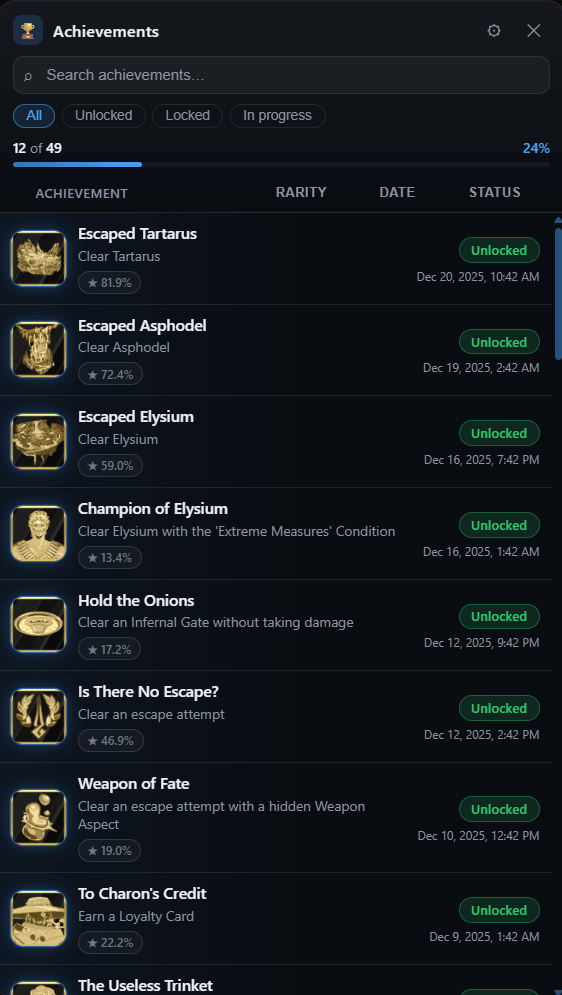

# In-game overlay list

The in-game overlay (`Ctrl+Shift+K` by default while a supported game runs) shows the
achievement list of the running game without leaving it: names, descriptions,
lock state, unlock dates and progress. The window is draggable by its header
and stays on top of the game.

 
Status, rarity and date columns, with search and filters

## What it shows

- A stats bar with `unlocked / total` and the completion percentage.
- One row per achievement with a colored status pill
  (`Unlocked` / `Locked`), the unlock date for earned achievements, and a
  progress bar + `current / max` label for progress achievements.
- A community-rarity badge (`★ 12.3%`) for every achievement with a known
  unlock rate (Epic/GOG official schemas and emulator sidecars). Common
  achievements use a dark-gray badge; rare ones use gold (≤5%), silver (≤10%)
  and bronze (≤15%) with a soft halo.

## Search and filters

- The search box filters rows by achievement name and description as you type.
- The pills above the list switch between **All**, **Unlocked**, **Locked** and
  **In progress**.
- Clicking the **Rarity**, **Date** or **Status** column header sorts ascending,
  then descending, then back to the natural order. Only one column sorts at a
  time, so activating another column resets the rest.
- Press `/` to focus the search box and `Esc` to clear it (or close the
  options panel if it is open).

## Controller (gamepad)

The overlay can be driven entirely from a controller once **Control the in-game
overlay with a controller** is enabled in **Settings → Controller**. With the
default bindings:

- **Back + Start + LB** opens or closes the overlay.
- **LB + X** toggles navigation mode - a focus ring shows where you are, and a
  small **UI** badge appears in the overlay header.
- In navigation mode: D-pad or left stick move the focus, **A** confirms,
  **B** cancels, **X** focuses the search, **Y** opens the options panel.
- Holding **LB + RB** moves the overlay with the left stick and scrolls the list
  with the right stick.

Every shortcut is configurable, button names follow the layout you pick, and the
overlay's hint bar always shows your own bindings rather than these defaults.
The [controller guide](controller.md) covers the settings, the supported pads and
the Windows caveat about the game still seeing your button presses.

## Customization

Open the **⚙** button in the overlay header to customize the list:

- **Accent** - five color presets, a custom color picker, or **Use app theme** to
  follow the main window's theme instead (used for progress, active filters,
  focus rings and unlocked-row glow).
- **Density** - Compact, Cozy or Spacious row spacing.
- **Icon size** - Small, Medium or Large.
- **Zoom** - 80% to 125% of the panel size.
- **Opacity** - 40% to 100% of the panel's background.
- **Show/hide toggles** for the stats bar, progress bars, rarity badges and
  descriptions.

Changes apply immediately and are saved locally, so they survive closing and
reopening the overlay. **Reset defaults** restores the original look.

## Keyboard shortcuts (overlay open)

- `Ctrl+Alt+Shift+Arrows` - nudge the overlay window.
- `Ctrl+Alt+Shift+1` … `5` - snap to a preset position.
- `Ctrl+Alt+Shift+C` - toggle click-through.

## Notes

- The overlay follows the interface language selected in the app.
- After the first open, the overlay window is kept hidden and reused for 5 minutes, so toggling
  it again during a session is near-instant; while hidden it pauses its controller/gamepad polling
  and the window is released after 5 minutes of inactivity to free its memory.
- Row content is escaped before rendering; achievement data is only displayed,
  never executed.
- The overlay list is separate from the one-shot overlay *notification*
  presets (Settings → Notification). Preset appearance is configured there.

---

**Next:** [Controller guide](controller.md) - drive the overlay and the app with a
gamepad.

[← Documentation](README.md) · [Notification guide](notifications.md) · [Project home](https://github.com/Shirowwww/Achievement-Watcher-Next)

