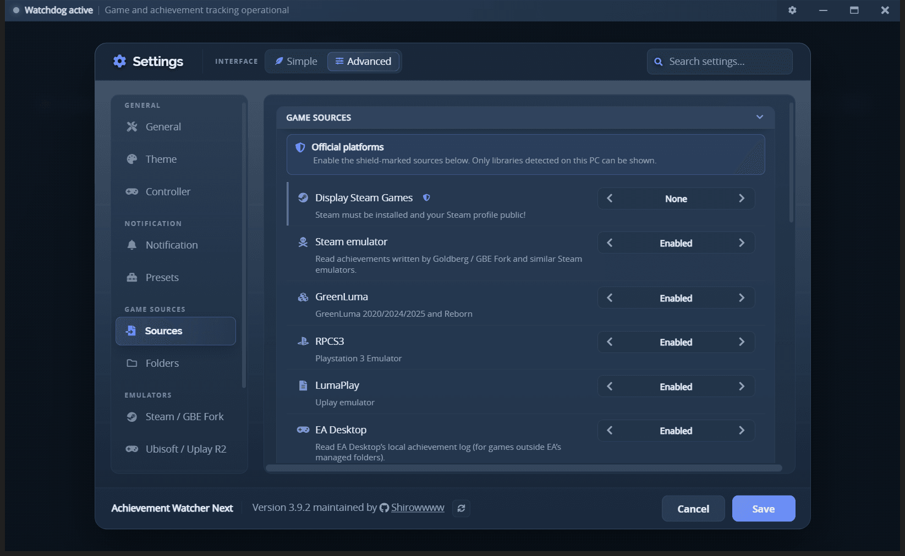
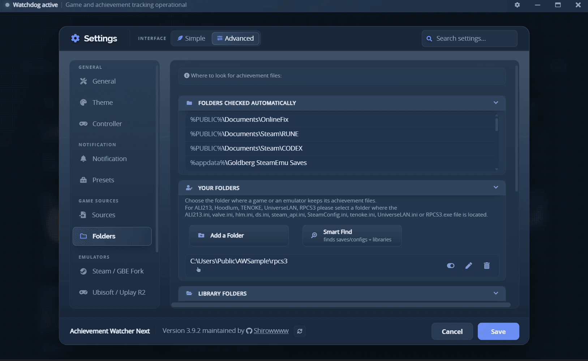

# Compatible sources

A **source** is one place AW Next can read achievements from: an official launcher's local data, a
Steam-compatible save file, or a console emulator's trophy file. Every source is switched on or off
individually in **Settings → Sources**.

 
Each source is a separate switch; the shield marks the official desktop libraries

After enabling a source, refresh the library. Only libraries actually detected on this PC are shown.

## Official platform libraries

These read the launcher's own local data. They are marked with a shield in Settings.

| Source | What AW Next reads | What it needs |
|---|---|---|
| **Steam** | Local appcache state, public-profile data, achievement schemas and cached product metadata | Steam installed, and your Steam profile set to public |
| **GOG Galaxy** | The Galaxy client's local databases, plus compatible legacy saves | GOG Galaxy installed |
| **Ubisoft Connect** | Native local data and legacy Uplay formats | Ubisoft Connect installed |
| **Epic Games** | Local installations, plus official achievement state once you connect an account | Epic Games launcher; account connection is optional |
| **Xbox PC** | Local Game Pass / Microsoft Store installs, plus imported Xbox Network achievement state | The Xbox app; account connection is optional |

**Display Steam Games** has three settings rather than on/off: **None**, **Installed** (games on this
PC) or **Owned** (your whole Steam library).

> [!IMPORTANT]
> Steam only exposes your achievements while your profile is public. In Steam, open
> **Profile → Edit Profile → Privacy Settings** and set both **My profile** and **Game details** to
> *Public*. With either set to private, Steam returns nothing and the games appear with no progress.

> [!NOTE]
> **EA Desktop** is deliberately different. It reads EA Desktop's local achievement log for games
> that sit outside EA's managed folders. It does not import your regular official EA library.

### Connected accounts

Epic and Xbox PC can optionally be connected from Settings to import achievement state the local
files do not carry. The token is encrypted before it is stored on this PC. Everything else works
without any account.

## Steam-compatible saves

AW Next reads the achievement and stats files written by Steam emulators - `achievements.json`,
`achievements.ini`, `achievements.bin`, `stats.ini` and compatible layouts - from the locations those
tools use.

That covers **Goldberg** and **GBE Fork** (the two AW Next can also install and repair),
**GreenLuma**, **LumaPlay**, **SmartSteamEmu**, **CreamAPI**, the **Nemirtingas** emulators and
scene releases writing a compatible layout. A game whose files are in a custom location can be added
under **Settings → Folders**.

 
The folders AW Next checks on its own, and the ones you add - per-game saves or whole libraries

Portable releases are covered too, and they are the case worth knowing about. A CODEX/RUNE/CPY
release normally writes to `%PUBLIC%\Documents\Steam\<SOURCE>\<appid>`, but a portable copy keeps
that same tree inside the game folder, where nothing is looking for it. Adding the game's own folder
under **Settings → Folders** is enough: its `steam_emu.ini` (or `cpy.ini`) names the AppID, and the
matching save tree is looked for beside it before the shared location is tried. If no save has been
written yet the game is still added, at 0% - a missing card would be indistinguishable from a game
that was never installed, and would say nothing about what went wrong.

A release that ships **no emulator config at all**, or whose ini you deleted, is covered as well:
the save tree itself is read, since `Steam\RUNE\<appid>` carries the AppID in its folder name.
The same layouts are probed one level below the folder you add, so pointing AW at your games
library works as well as pointing it at one game.

When a folder cannot be used, AW says why rather than only that it is invalid: whether it holds a
game but no readable unlock file, whether it holds nothing achievement related at all, or whether
it is an **EA app** release. That last one never keeps achievements on disk - they live on the EA
account, and AW reads them through the EA source rather than through a watched folder, so no folder
you add can make such a game appear. The message also names how many layouts were probed, so
"nothing found here" is distinguishable from "not looked at".

Two of these are a different shape and are handled separately:

- **Goldberg SocialClub** - the Rockstar / Social Club variant, with its own source switch.
- **Uplay R2** - the Ubisoft equivalent of the Goldberg path, for compatible titles. It has no
  source switch of its own: the saves flow through the Steam emulator source, and its repair and
  loader tools live in **Settings → Emulators → Ubisoft / Uplay R2**. See
  [Uplay R2 setup](uplay-r2.md).

If a game using one of these shows no achievements, its **Game Health** panel names the missing
piece - see [Game Health](game-health.md) and [Goldberg / GBE setup](emulator-setup.md).

## Console emulators

| Emulator | Console | Trophy / achievement file |
|---|---|---|
| **RPCS3** | PlayStation 3 | `TROPUSR.DAT` beside the trophy list |
| **ShadPS4** | PlayStation 4 | `TROP*.XML`, which holds the list and the earned state together |
| **Xenia** | Xbox 360 | `.gpd`, which likewise holds both |

Each one is watched live, so an unlock in the emulator raises a notification like any other.

## Other sources

| Source | What it is |
|---|---|
| **Import notification cache** | Reads the background tracker's own cache as an extra source of past unlocks. |
| **Manually added games** | A game added from a title and executable, with an optional platform and Steam AppID - see [Advanced tools](advanced.md#add-a-game-manually). |

## Steam metadata, without an API key

No Steam Web API key and no connected Steam account are used. Each game's achievement list is
fetched with a keyless chain: the official `GetGameAchievements` endpoint first (which carries hidden
descriptions, icons and global rarity), then SteamHunters enriched with the SteamCommunity page, then
SteamCommunity alone, and a browser scrape only as a last resort.

Results are cached per language in `%APPDATA%\Achievement Watcher Next\steam_cache\schema`, so local
sources and previously seen games keep working offline.

Steam never announces when a game update adds achievements, so a cached list re-checks itself every
3 days and picks up anything new without ever removing an achievement already cached. To check
immediately, use **Settings → Advanced → Recheck achievement lists**.

DLC and update achievements are tagged with the group that owns them (for example a
*Hearts of Stone* tag) under the achievement title. The groups come from the same keyless lookup.

## Sources you do not see

In **Simple** interface mode the Sources list folds away six niche rows - GreenLuma, LumaPlay, the
two Nemirtingas emulators (the GOG and Epic save readers), Goldberg SocialClub and the
notification-cache import - but only while a row is still enabled *and* no game in your library came
from it. Switch one off, or own a game it detected, and its row comes straight back. **Advanced**
always lists every source.

That rule exists so the interface mode can never hide the one control that would explain a missing
game.

---

**Next:** [Notifications](notifications.md) - choose how unlocks are announced.

*Source-specific setup: [Goldberg / GBE](emulator-setup.md) · [Uplay R2](uplay-r2.md) ·
[Game Health](game-health.md)*

[← Documentation](README.md) · [Project home](https://github.com/Shirowwww/Achievement-Watcher-Next)

