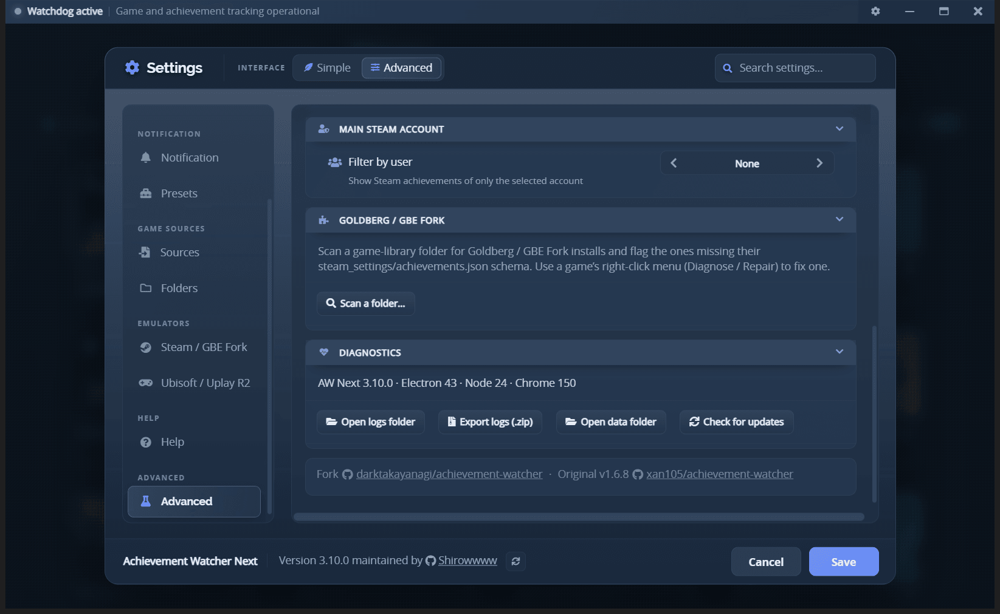

# Troubleshooting

## Start here

If the problem concerns **one game**, open that game's **[Game Health](game-health.md)** panel first.
It states whether AW Next can see the game, read its achievements and announce its unlocks, and it
offers only the repairs that genuinely apply. Most single-game problems end there.

Use the rest of this page for problems that affect the app as a whole. **Settings → Help** carries
the same checks in short form, under its *Something is wrong* group, with your own hotkey, bindings
and enabled sources filled in. If a problem remains, include the app version, Windows version, source
involved, exact reproduction steps and relevant logs in the bug report.

## Open logs and local data

<div align="center">
<br>
<sub>App/runtime versions and quick access to logs, data and update checks</sub>
</div>

The **Advanced** tab only exists while the interface is in Advanced mode. If you do not see it,
switch the **Interface** control at the top of **Settings** from Simple to Advanced first - nothing
is lost by switching back afterwards (see [getting-started.md](getting-started.md#simple-and-advanced)).

Use **Settings → Advanced → Diagnostics** to open the log or data directory. The default log path is:

```text
%APPDATA%\Achievement Watcher Next\logs
```

The most useful files are usually `Achievement Watcher.log`, `renderer.log`, `parser.log` and the
Watchdog logs of the affected source. A failure that crosses scanning, UI and notification behavior
needs several of them, so use **Export logs (.zip)** in the same Diagnostics card rather than copying
files by hand: the processes writing those logs never stop appending, so a manual copy can catch a
half-written line. The export works with the app running and adds an `about.txt` with the app,
Electron, Node and Chrome versions the logs came from.

Logs are appended, never truncated, so a crash survives the next launch. Each run starts with a marker, which is how you tell one launch from the next:

```text
===== session 2026-08-11T00:53:31.890Z pid=19276 =====
```

Right after it, a `[diag]` block records what a bug report needs - versions, install and data paths, how the app was started, the active language and theme, and the geometry of every display:

```text
[diag] app: Achievement Watcher 3.10.0 (packaged)
[diag] runtime: electron 43.4.0 · chrome 150.0.7871.224 · node 24.18.1 · v8 15.0
[diag] display: 3056414223 1080x1920 @1x work=1080x1872 rotation=270
[diag] display: 3933707034 (primary) 2048x1152 @1.25x work=2048x1104 rotation=0
```

Paste that block into an issue. Window size and placement problems are almost always a display-scaling or multi-monitor story, and the `[MainWindow]` lines that follow record the window's bounds every time it is shown, moved, resized or closed - including which display it was on.

Each log file rotates to `<name>.log.1` past 2 MB, so one older generation is always kept.

## A game is missing

1. Open **Settings → Sources** and confirm the relevant integration is enabled.
2. Open **Settings → Folders**, run **Smart Find**, then use **Generate configs** for a full scan.
3. Add the actual game library or save root manually if it uses a custom location.
4. Turn off **Installed games only** temporarily to see whether the game is known but no longer considered installed.
5. For emulator saves, launch the game once so it creates a runtime folder.

If only old save residue remains and the game files are gone, the installed-only filter is expected to hide the entry.

A game whose metadata could not be fetched is never removed from the list: what is on disk decides
that a game exists, and the online lookup only decorates it. Such an entry appears with whatever
name is known locally and fills itself in on a later scan.

## Achievements stay locked or show 0%

No runtime unlock file means 0%, even when a complete achievement list is present.

Open the game's **[Game Health](game-health.md)** panel: it names which part is missing and offers
the repair for it - rewriting the achievement data, restoring the emulator file, or correcting a
`steam_appid.txt` that names another game. If you would rather check by hand:

- verify that the detected AppID or platform ID belongs to the correct game;
- check for a custom save path;
- repair a mismatched `steam_settings` schema only after reviewing the report.

A game with no achievement set at all displays **No achievements** rather than 0%, and is left out of
completion statistics.

See [Goldberg and GBE Fork setup](emulator-setup.md#common-problems) or [Goldberg Uplay R2 setup](uplay-r2.md#achievements-remain-at-0) for source-specific steps.

## Names, descriptions or artwork are missing

- Refresh while online so the app can retry its metadata sources.
- Confirm the game's platform identity is correct; a wrong Steam AppID can return convincing but unrelated metadata.
- For Goldberg/GBE, a valid local schema can fill some missing text offline.
- Use the game's cover actions to retry or choose local artwork when automatic sources fail.

A card titled with its bare Steam AppID means the name lookup came back empty for that game while
its artwork, which is derived from the AppID alone, resolved. The entry is kept rather than hidden,
and the next scan replaces the number with the real title once the lookup succeeds.

DLC and update achievements show their owning group under the title (e.g. a "Hearts of Stone"
tag) when SteamHunters knows the groups; games without groups are left untagged.

Hidden achievement descriptions may stay hidden when every available source intentionally omits them.

## A game update added achievements that aren't showing up

A cached schema re-checks itself against Steam every 3 days, since Steam never announces when an
update adds achievements. To pick them up immediately instead of waiting, use **Settings → Advanced
→ Recheck achievement lists**. Existing achievements and unlocks are never removed by this check.

## An update is stuck on the same file

Downloaded update files are kept between runs. If a download keeps failing on the same file, use
**Settings → Advanced → Clear caches** and check for updates again. Only re-downloadable caches
are deleted - settings, game data and logs are untouched.

## Notifications do not appear

1. Confirm the background tracker is running.
2. Open the game and read the Notifications row of its **Game Health** panel: it names the transport
   that actually delivered the last notification for that game, and why.
3. Use the normal, rare and overlay tests under **Settings → Notification**.
4. Confirm the delivery mode and selected preset. On **Automatic**, a missing overlay popup is often
   the intended fallback rather than a fault - see [Notifications](notifications.md#how-automatic-decides).
5. Check Windows notification permissions for AW Next.
6. If the issue happens only while playing or in full screen, turn on **Priority notifications** under
   **Settings → Notification** and accept the Windows permission prompt.
7. Test the overlay outside exclusive fullscreen mode.
8. Review the logs immediately after a failed test or unlock.

If the library updates but no notification appears, the source watcher works and the problem is likely in the selected notification transport. If the library also stays unchanged, diagnose the source or save path first.

## The OBS browser source stays empty

1. Press **Preview** under **Settings -> Notification -> OBS browser source**, or open
   `http://127.0.0.1:8082/obs/?test=1` yourself. A sample card every ten seconds means the page and
   the feed both work, and the problem is the source's settings in OBS.
2. Nothing at all, not even a blank page: another copy of AW Next, or another program, holds port
   8082. Only the copy that started first serves the address.
3. A page that stays blank is normal between unlocks - it draws nothing on purpose. Use `?test=1` to
   see it draw.
4. Check that **Websocket @localhost:8082** is on under **Settings -> Notification -> Transport**:
   the source reads that feed.
5. The card fills whatever size the source is, so it cannot be too small to see. If it looks soft,
   give the source more pixels and place it smaller in the scene.

See [Show unlocks on stream (OBS)](notifications.md#show-unlocks-on-stream-obs) for the full setup.

## A game will not start from the Play button

Some games require administrator rights, either because their manifest asks for it or because their
launcher expects it. Windows refuses to start those the way AW Next normally starts a game and
reports `EACCES`.

AW Next then retries through the Windows shell, the route that raises the ordinary UAC prompt, so
such a game starts once you confirm. If even that is refused - a launcher needing administrator
without declaring it - AW Next offers to retry as administrator explicitly. Only the game is
elevated: an elevated AW Next would create its files with permissions your normal account cannot
rewrite.

Dismissing the UAC prompt is treated as a decision, not a failure, so nothing is reported.

## Playtime is not tracked

AW Next follows the configured game executable and its process lifetime. If a launcher, helper or differently named binary starts instead:

- right-click the game and open its configuration;
- select the executable that remains active while playing;
- avoid launcher and crash-handler processes;
- restart the game after saving the change.

## Ubisoft or Uplay R2 uses the wrong action

Ubisoft games should receive Ubisoft-specific metadata and the Uplay R2 repair action, not the Steam GBE action. Run a fresh folder scan and check the source icon. If the game is still misidentified, attach `parser.log`, the displayed source/IDs and the game directory name to a report.

## Antivirus or SmartScreen warning

Packaged releases are signed with the project's self-signed publisher certificate, not a publicly
trusted commercial certificate, so Windows SmartScreen may still warn. You never need to install
the certificate: the in-app updater accepts the exact `CN=Shirow` identity even when Windows does
not trust its root, and independently checks the SHA-512 release manifest. Optional emulator DLLs
can also trigger heuristic detections. Download only from the [official Releases page](https://github.com/Shirowwww/Achievement-Watcher-Next/releases) and compare the installer against the SHA-512 value stored in the matching `latest.yml`.

Do not disable system-wide protection. Submit a false-positive report to the antivirus vendor when a file from the official release is incorrectly quarantined.

### Checking a release yourself

Every published installer can be looked up on VirusTotal by its own SHA-256, so you never have to
take this page's word for it:

```powershell
Get-FileHash "Achievement.Watcher.Setup.3.10.4.exe" -Algorithm SHA256
```

Open `https://www.virustotal.com/gui/file/<the hash it prints>`. If the file is the published one,
the report is already there. For the current release that is
[the 3.10.4 installer](https://www.virustotal.com/gui/file/98737bd01f34be8aa8d86da8c9de5d52a62b070c091c6611366b174421932f99)
(`98737bd01f34be8aa8d86da8c9de5d52a62b070c091c6611366b174421932f99`).

Read the result for what it is: a list of what each engine thinks, not a certificate. A handful of
heuristic detections on a build that bundles emulator files is expected and is the false positive
described above; what matters is that the hash matches the file the releases page published, which
is what the command above proves.

### The emulator files are flagged

This is the detection people actually hit, and it is a false positive. Recording achievements for a
game with no store client running means putting a stand-in library beside it: the Steam emulator
(GBE Fork) or a Ubisoft loader. Replacing a game's Steam or Ubisoft library is precisely the
behaviour detection engines exist to notice, so they notice it - on what the file *does*, not on
anything it contains. Windows Defender quarantines every copy it can see in one go: the one in the
game folder, the ones installed with AW Next, and the ones in its cache.

**When it fires.** At the moment a file is written, and only then:

| What you did | What gets written |
|---|---|
| Ran a repair, from a game's menu or from Settings | the emulator or loader, into that game's folder |
| Opened **Settings → Emulators → Ubisoft / Uplay R1/R2** | the bundled loaders, into AW Next's own cache |
| Turned on **Automatically fix newly detected games** | the same, during a scan, for each game that needs it |

Launching AW Next writes none of them. Automatic repair is off unless you switch it on, and it tells
you to expect this beforehand, with the chance to add a Defender exclusion first. If you had already
turned it on, the same thing is said once, the first time it is about to act, with the exclusion and
the off switch on the same dialog. Nothing is written while the window is hidden in the tray, since
you would have no way of connecting the alert to anything.

**What AW Next does about it.** A quarantine is reported as an antivirus problem rather than as a
failure of its own, with a button to allow the folder in Windows Defender and another to put the
removed files back. **Settings → Emulators → Ubisoft / Uplay R1/R2 → Restore integrated DLLs** does
that restore at any time.

**What to do.** Allow the specific file your antivirus named, or exclude
`%APPDATA%\Achievement Watcher Next\cache`. Note what an exclusion does not cover: it protects
AW Next's own copies, and the copy written into a game folder can still be flagged - exclude that
game's folder too if it keeps happening. Reporting the false positive to your vendor is what
eventually fixes it for everybody.

**If you would rather check first.** Both are third-party and open source: the Steam emulator is
downloaded from the official [GSE Fork releases](https://github.com/Detanup01/gbe_fork), and the
Ubisoft loaders ship in `app/resources/uplayR1/` and `app/resources/uplayR2/` in the repository.
AW Next verifies the bundled ones against known SHA-256 digests, their PE architecture and their
achievement capability before any repair may use them, and a file that fails is refused.

## The window does not open

- Use the tray icon in case the app started hidden.
- End a stuck AW Next process, then launch it once more.
- Remove `ELECTRON_RUN_AS_NODE` from the environment if it was set for development; that variable makes Electron start as plain Node.
- Check `renderer.log` and the main app log for the first error.
- Try **Settings → General → Disable hardware acceleration** if the UI is visible long enough to change it.

## Start with a fresh profile

Use this only after backing up data you want to keep:

1. Exit AW Next fully from the tray.
2. Rename `%APPDATA%\Achievement Watcher Next` to `Achievement Watcher Next.backup`.
3. Start the app and reproduce the issue with the new profile.

If the issue disappears, restore only the data you need or attach the relevant configuration files to the report. Renaming is safer than deleting because it keeps a rollback path.

## Report the problem

Search the [existing issues](https://github.com/Shirowwww/Achievement-Watcher-Next/issues) first. If no report matches, open a bug using the repository template and attach logs after removing any information you do not want to share publicly.

---

**See also:** [FAQ](faq.md) for short answers · [Advanced tools](advanced.md) for maintenance,
cache clearing and resets · [Game Health](game-health.md) for single-game problems.

**That's the end of the user path.** From here the documentation turns technical:
[Goldberg/GBE reference](goldberg-gbe.md) for file formats and detection rules, and
[Architecture](architecture.md) for the app / renderer / Watchdog boundaries.

<div align="center">

[← Documentation](README.md) · [Getting started](getting-started.md) · [Project home](https://github.com/Shirowwww/Achievement-Watcher-Next)

</div>