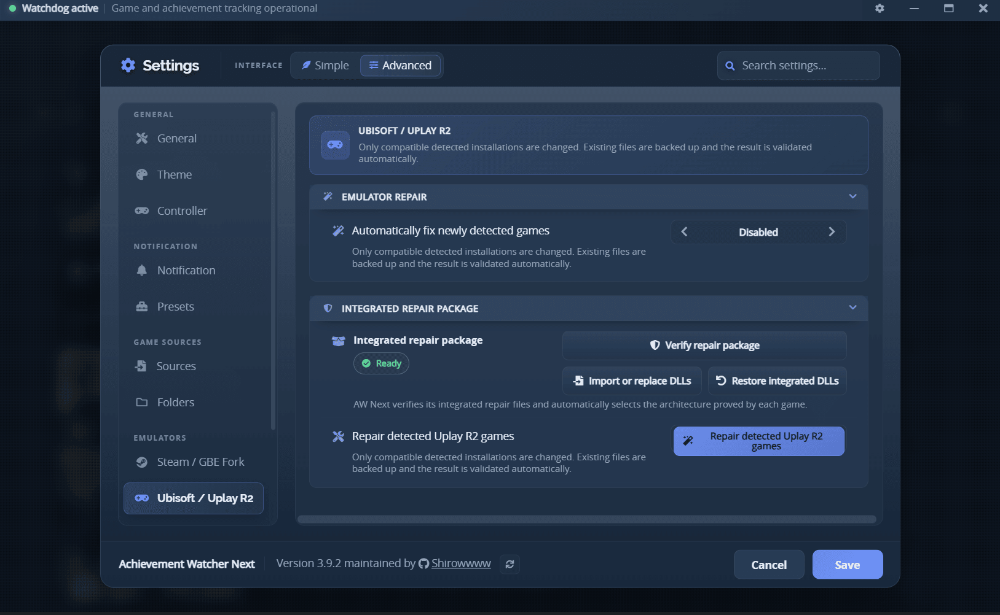

# Goldberg Uplay R2 setup

AW Next has a separate repair for compatible Ubisoft games using Goldberg Uplay R2. Official
Ubisoft Connect games are never selected from a DLL name alone.

> [!WARNING]
> The repair changes game files. Use it only with games you own.

## What is required

AW Next must be able to:

1. identify the Ubisoft game and its installation;
2. match it to a Steam release, either from `app/assets/uplay-steam.json` or from a choice you confirm;
3. map the Steam achievement names to Ubisoft objective IDs;
4. prove the exact loader name and x86/x64 architecture used by the game.

If any proof is missing, the repair stops without guessing. This also prevents an official Ubisoft
loader with a similar filename from being replaced.

## Settings

Open **Settings → Emulators → Ubisoft / Uplay R2**. The main controls are:

 
The integrated repair package is verified before any game is touched

- **Automatically fix newly detected games**;
- **Repair detected Uplay R2 games**, for one confirmed batch;
- **Import or replace DLLs**, for a newer local loader;
- **Restore integrated DLLs**, to return to the version shipped with AW Next.

Loader configuration stays automatic. AW Next selects the proven architecture and writes the
required schema and configuration during repair; loader and INI options are not exposed in the app.

The four integrated DLLs are visible in `app/resources/uplayR2/`. A recovery archive is kept beside
them in case antivirus software removes a loose DLL. A manually selected DLL does not need a known
SHA-256 fingerprint, but it must still be a valid achievement-capable Uplay R2 PE with a coherent
name and architecture. The integrated x64 aliases use the July 2026 loader build; the x86 aliases
remain on the June 2026 build.

The bundled files are checked by their hashes, PE architecture and achievement capability before
they can be used by a repair.

## Repair one game

1. Add the game library in **Settings → Folders** and scan it.
2. Open the game's **Game Health** page.
3. Review **Diagnose Uplay R2 setup**.
4. Run **Apply emulator fix (Uplay R2)** and launch the game once.

Game Health displays the resolved Steam AppID alongside loader, schema, configuration and save
problems. If no automatic identity exists, its Uplay R2 repair button opens the same validated manual
fallback as the context menu; after a successful repair the panel rebuilds its diagnosis.

The same transaction is used by the context menu, Game Health, automatic repair, Fix All, and the
Uplay batch button.

### Games missing from the built-in map

If the game is not in `uplay-steam.json`, AW Next first reuses the Ubisoft→Steam identity resolver
already used for Steam artwork and global achievement percentages. A successful high-confidence
catalog match promotes the Uplay R2 game into the normal Steam schema pipeline, so its achievement
names, descriptions, icons and percentages all use the same resolved AppID.

Only when that automatic identity is unavailable does an interactive repair offer ranked Steam
catalog matches. A `steam_appid.txt` found under the game folder is shown first as a hint, but is never
trusted without your confirmation. AW Next fetches the selected Steam schema and verifies that every
achievement name can be converted safely to a Ubisoft objective ID.

A manual mapping is written to `cfg/uplay-r2-mappings.json` only after its Steam schema passes
validation; when it is chosen during a repair, the transaction must also succeed first. It is scoped
to that exact installation folder. Use **Identify the game (Steam AppID)** in the game's right-click
menu to replace a saved choice. Conflicting choices for the same Ubisoft product fail closed unless
the exact installation folder identifies which one applies.

## What changes

The repair installs only the loader proved by the game, generates `achievements_schema.json`, and
updates both `upc_r2.ini` and `uplay_r2.ini`. Modern loaders redirect achievement data into
`%APPDATA%\GSE Saves\<steamAppid>`; older compatible loaders keep their own save folder and AW Next
reads it there.

Every changed DLL, schema, and INI is snapshotted under
`<game>\.aw-backups\<timestamp>\`. Validation runs after the write and restores that snapshot
automatically if anything fails. Repeating an identical repair is a no-op.

## Achievements remain at 0%

- Run **Diagnose Uplay R2 setup** again and check the reported runtime folder.
- Reapply the repair after a game update; updates often remove the schema or reset
  `Achievements = 0`.
- If the loader already produced a diagnostic log, inspect it beside the executable.
- Check `%APPDATA%\Achievement Watcher Next\logs\parser.log`.

Games whose Steam achievements do not follow a safe Steam-to-Ubisoft objective-ID convention remain
unsupported. See the
[Goldberg / GBE guide](emulator-setup.md) for the Steam equivalent.

[← Documentation](README.md) · [Troubleshooting](troubleshooting.md) · [Project home](https://github.com/Shirowwww/Achievement-Watcher-Next)

